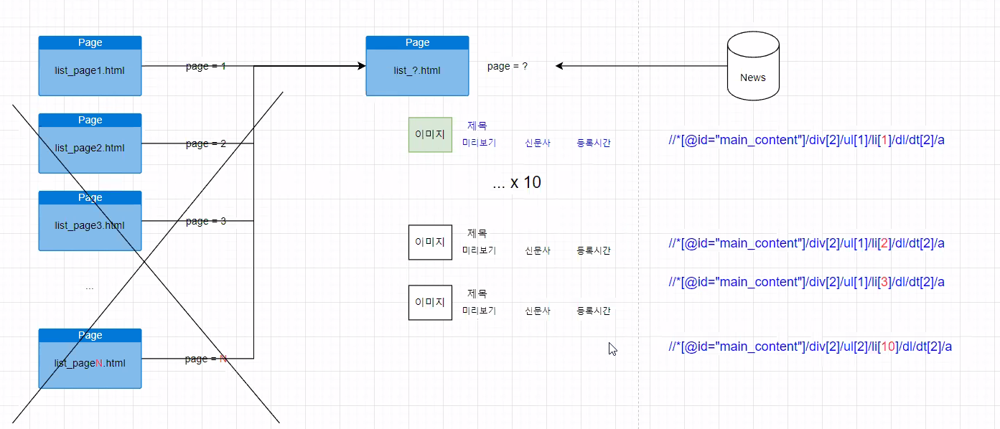

```shell
* chrome driver
http://chromedriver.chromium.org/downloads


* 아나콘다 가상환경 목록
$ conda info --evns

* 아나콘다 가상환경 생성
$ conda create --name [가상환경이름]

* 아나콘다 가상환경 삭제
$ conda remove --name [가상환경이름] --all

* 가상환경 실행/종료
$ conda activate [가상환경이름]
$ conda deactivate 

* Selenium 설치
$ pip install selenium
$ conda install selenium
```



## Scrapy

```shell
$ scrapy startproject scrapy_example

$ scrapy crawl mybots<스파이더명>
```

```python
# mybots.py

import scrapy
from myscraper.items import MyscraperItem


class MybotsSpider(scrapy.Spider):
    name = 'mybots'
    allowed_domains = ['naver.com']
    start_urls = ['https://news.naver.com/main/list.nhn?mode=LS2D&sid2=258&sid1=101&mid=shm&date=20210119&page=1']

    def parse(self, response):
        titles = response.xpath('//*[@id="main_content"]/div[2]/ul/li/dl/dt[2]/a/text()').extract()
        writers = response.css('.writing::text').extract()
        previews = response.xpath('//*[@id="main_content"]/div[2]/ul/li/dl/dd/span[1]/text()').extract()

        # items = list(zip(titles, writers, previews))

        items=[]
        # items에 XPATH, CSS를 통해 추출한 데이터를 저장
        for idx in range(len(titles)):
            item =MyscraperItem()
            item['title'] = titles[idx]
            item['writer'] = writers[idx]
            item['preview'] = previews[idx]

            items.append(item)

        return items
    
# items.py

import scrapy


class MyscraperItem(scrapy.Item):
    # define the fields for your item here like:
    # name = scrapy.Field()
    title = scrapy.Field()
    writer = scrapy.Field()
    preview = scrapy.Field()
    
    
# setting.py

ROBOTSTXT_OBEY = False

FEED_FORMAT = "csv"
FEED_URI = "my_news.csv"
FEED_EXPORT_ENCODING = 'utf-8 sig'

# FEED_FORMAT = "json"
# FEED_URI = "my_news.json"
# FEED_EXPORT_ENCODING = 'utf-8'
```

