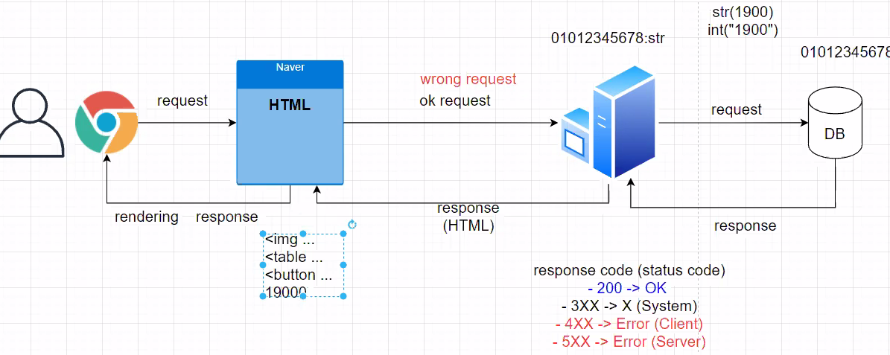

- HTML에서 볼 수 있는 숫자 데이터는 모두 String형태임
- int 형태 저장을 원하면 casting해서 전달

- yield : 함수안에 제너레이터기능을 사용하기 위해 쓰는 키워드
  - for문을 예시로 생각하면 한번에 return <list>할 수도 있음
  - yield를 사용하면 item하나하나씩 yield를 사용하여 따로따로 파라미터 넘기기가 가능

conda로 sqlite 직접 실행

```shell
$ python managy.py dbshell

$ .tables

$ PRGMA table_info(table명)
```


