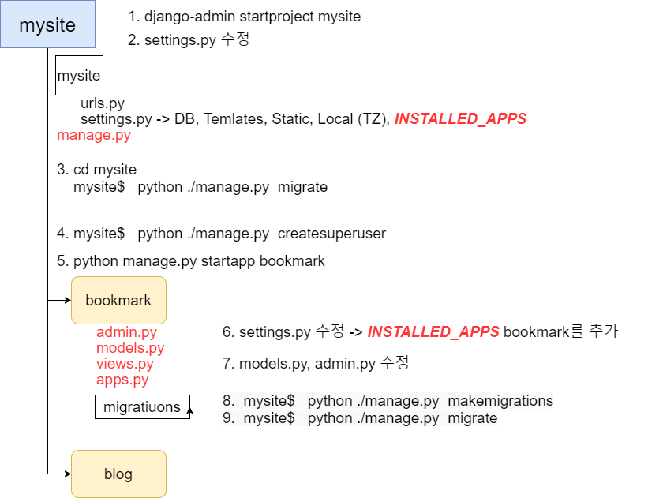

## slug 

> The 46 Year Old => the-46-year-old

- url 형태로 오류 없이 사용하기 위해 모든 문자가 소문자화 되어있고, 공백은 `-`로 교체되어있는 표기법

### [Django get_absolute_url() 참고](https://wayhome25.github.io/django/2017/05/05/django-url-reverse/)

- html단에서 불필요한 부분을 제거하고 서버 django, 파이썬쪽에서 url 편하게 쓸 수 있도록 만든 메서드

### API

> **API**(Application Programming Interface, 응용 프로그램 프로그래밍 인터페이스)는 [응용 프로그램](https://ko.wikipedia.org/wiki/응용_프로그램)에서 사용할 수 있도록, [운영 체제](https://ko.wikipedia.org/wiki/운영_체제)나 [프로그래밍 언어](https://ko.wikipedia.org/wiki/프로그래밍_언어)가 제공하는 기능을 제어할 수 있게 만든 [인터페이스](https://ko.wikipedia.org/wiki/인터페이스_(컴퓨팅))를 뜻한다. 주로 파일 제어, 창 제어, 화상 처리, 문자 제어 등을 위한 인터페이스를 제공한다. - [위키](https://ko.wikipedia.org/wiki/API)

### Library

> **라이브러리**([영어](https://ko.wikipedia.org/wiki/영어): library)는 주로 [소프트웨어를 개발할](https://ko.wikipedia.org/wiki/소프트웨어_개발) 때 [컴퓨터 프로그램](https://ko.wikipedia.org/wiki/컴퓨터_프로그램)이 사용하는 [비휘발성 자원](https://ko.wikipedia.org/wiki/비휘발성_메모리)의 모임이다. 여기에는 구성 데이터, 문서, 도움말 자료, 메시지 틀, [미리 작성된 코드](https://ko.wikipedia.org/wiki/코드_재사용), [서브루틴](https://ko.wikipedia.org/wiki/서브루틴)(함수), [클래스](https://ko.wikipedia.org/wiki/클래스_(컴퓨터_과학)), [값](https://ko.wikipedia.org/wiki/값_(컴퓨터_과학)), [자료형](https://ko.wikipedia.org/wiki/자료형) 사양을 포함할 수 있다. [OS/360](https://ko.wikipedia.org/wiki/OS/360) 및 이후 세대에서는 [파티션 데이터 세트](https://ko.wikipedia.org/wiki/데이터_세트_(IBM_메인프레임))로 부른다. - [위키](https://ko.wikipedia.org/wiki/%EB%9D%BC%EC%9D%B4%EB%B8%8C%EB%9F%AC%EB%A6%AC_(%EC%BB%B4%ED%93%A8%ED%8C%85))

### platform

> **컴퓨팅 플랫폼**([영어](https://ko.wikipedia.org/wiki/영어): computing platform)은 소프트웨어가 구동 가능한 하드웨어 아키텍처나 소프트웨어 프레임워크(응용 프로그램 프레임워크를 포함하는)의 종류를 설명하는 단어이다. 일반적으로 플랫폼은 컴퓨터의 아키텍처, [운영 체제](https://ko.wikipedia.org/wiki/운영_체제)(OS), 프로그램 언어, 그리고 관련 런타임 라이브러리 또는 [GUI](https://ko.wikipedia.org/wiki/그래픽_사용자_인터페이스)를 포함한다.
>
> **플랫폼**은 응용 소프트웨어를 실행하기 위해 쓰이는 하드웨어와 소프트웨어의 결합이다. 플랫폼은 하나의 운영 체제 또는 컴퓨터 아키텍처라고 단순히 말할 수 있으며 그 두 가지를 통칭해서 말할 수도 있다. - [위키](https://ko.wikipedia.org/wiki/%EC%BB%B4%ED%93%A8%ED%8C%85_%ED%94%8C%EB%9E%AB%ED%8F%BC)

### framework

> **애플리케이션 프레임워크**(application Framework)[[1\]](https://ko.wikipedia.org/wiki/애플리케이션_프레임워크#cite_note-1)는 [소프트웨어 개발자](https://ko.wikipedia.org/wiki/소프트웨어_개발자)가 [응용 소프트웨어](https://ko.wikipedia.org/wiki/응용_소프트웨어)의 표준 구조를 구현하기 위해 사용하는 [소프트웨어 프레임워크](https://ko.wikipedia.org/wiki/소프트웨어_프레임워크)로 구성된다.[[2\]](https://ko.wikipedia.org/wiki/애플리케이션_프레임워크#cite_note-2) 즉, 프로그래밍에서 특정 [운영 체제](https://ko.wikipedia.org/wiki/운영_체제)를 위한 응용 프로그램 표준 구조를 구현하는 [클래스](https://ko.wikipedia.org/wiki/클래스)와 [라이브러리](https://ko.wikipedia.org/wiki/라이브러리) 모임이다. 간단하게 [프레임워크](https://ko.wikipedia.org/wiki/프레임워크)라고도 부른다.
>
> 재사용할 수 있는 수많은 코드를 프레임워크로 통합함으로써 개발자가 새로운 애플리케이션을 위한 표준 코드를 다시 작성하지 않아도 같이 사용된다. 애플리케이션 프레임워크는 [그래픽 사용자 인터페이스](https://ko.wikipedia.org/wiki/그래픽_사용자_인터페이스)(GUI)의 구현에 일반화되었다. 그 까닭은 GUI 응용 프로그램의 기본 구조의 표준화를 촉진하는 경향이 있기 때문이다. 응용 프로그램의 기본 코드 구조가 명백하므로 표준 프레임워크를 사용하면 자동으로 GUI 툴을 만드게 된다. 프레임워크의 구현은 [객체 지향](https://ko.wikipedia.org/wiki/객체_지향) 프로그래밍 기법이 사용되고 있는 응용 프로그램 고유의 클래스가 프레임워크의 기존 클래스를 상속할 수 있다. - [위키](https://ko.wikipedia.org/wiki/%EC%95%A0%ED%94%8C%EB%A6%AC%EC%BC%80%EC%9D%B4%EC%85%98_%ED%94%84%EB%A0%88%EC%9E%84%EC%9B%8C%ED%81%AC)

### platform > framework > api > library