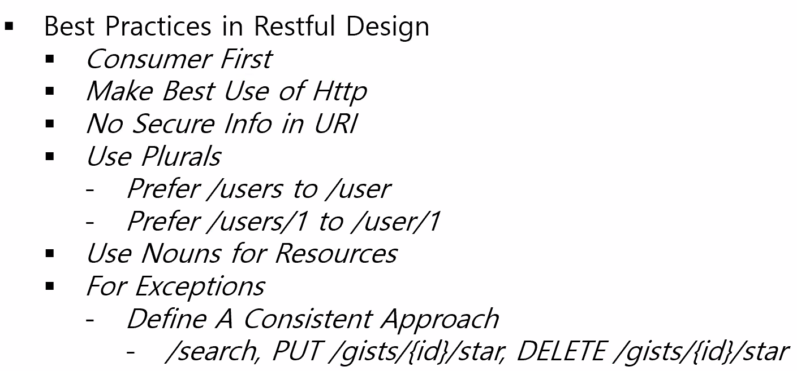
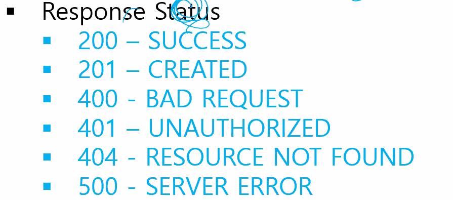

REST

> **REST**(Representational State Transfer)는 [월드 와이드 웹](https://ko.wikipedia.org/wiki/월드_와이드_웹)과 같은 분산 [하이퍼미디어](https://ko.wikipedia.org/wiki/하이퍼미디어) 시스템을 위한 [소프트웨어 아키텍처](https://ko.wikipedia.org/wiki/소프트웨어_아키텍처)의 한 형식이다. 이 용어는 로이 필딩(Roy Fielding)의 2000년 박사학위 논문에서 소개되었다. 필딩은 [HTTP](https://ko.wikipedia.org/wiki/HTTP)의 주요 저자 중 한 사람이다. 이 개념은 네트워킹 문화에 널리 퍼졌다.
>
> 엄격한 의미로 **REST**는 네트워크 아키텍처 원리의 모음이다. 여기서 '네트워크 아키텍처 원리'란 자원을 정의하고 자원에 대한 주소를 지정하는 방법 전반을 일컫는다. 간단한 의미로는, 웹 상의 자료를 [HTTP](https://ko.wikipedia.org/wiki/HTTP)위에서 [SOAP](https://ko.wikipedia.org/wiki/SOAP)이나 쿠키를 통한 세션 트랙킹 같은 별도의 전송 계층 없이 전송하기 위한 아주 간단한 인터페이스를 말한다. 이 두 가지의 의미는 겹치는 부분과 충돌되는 부분이 있다. 필딩의 **REST** 아키텍처 형식을 따르면 [HTTP](https://ko.wikipedia.org/wiki/HTTP)나 [WWW](https://ko.wikipedia.org/wiki/WWW)이 아닌 아주 커다란 소프트웨어 시스템을 설계하는 것도 가능하다. 또한, [리모트 프로시저 콜](https://ko.wikipedia.org/wiki/리모트_프로시저_콜) 대신에 간단한 [XML](https://ko.wikipedia.org/wiki/XML)과 [HTTP](https://ko.wikipedia.org/wiki/HTTP) 인터페이스를 이용해 설계하는 것도 가능하다.
>
> 필딩의 **REST** 원리를 따르는 시스템은 종종 RESTful이란 용어로 지칭된다. 열정적인 REST 옹호자들은 스스로를 RESTafrians 이라고 부른다.
>
> [위키](https://ko.wikipedia.org/wiki/REST)

- 쓰는 이유? 기존 HTML은 웹브라우저에서만 쓸 수 있는 통신 규약이기 때문에 현재 태블릿, 스마트폰등 다양한 기기의 앱형태에서 서버와 클라이언트간에 쉽게 통신 할 수 있도록 RESTful API형태로 데이터를 주고 받음

- level 0~3 성숙도 모델

  - 0 level : http://server/... -> (getdata, deletedata 등) 상세하게 다 써놓음
  - 1 level : ... ->(account, account/10) 불필요한 수식어 뺴고 적절하게 쓸 것만 씀
  - 2 level : 1 level + HTTP Method, Resource의 상태를 맞춰 사용
    - ex) 책 정보(목록), 상세보기, 등록, 수정, 삭제
      - GET : 목록보기
      - DELETE : 삭제
      - POST : 등록
      - PUT : 수정
  - 3 level : 2 level + HETEOAS
    - 하나의 기능을 요청했는데 반환값에서 새로운 기능을 제공받는 것을 헤테오스라함
      - ex) 서버에게 계정 가입 요청 => 계정 상세보기 기능을 반환해주면서 새롭게 소개

  

- 200 - 일반 요청 성공
- 201 - POST, PUT 성공
- 400 - 예를 들어 ID만 있고 패스워드가 없을때
- 401 - 인증이 안되어있을때
- 404
- 500 - 버그, 서버 시스템 문제 있을 때

### uri, url??

## Django REST framework

- Serializers : client에게 전달하기 위한 Format
  - 기존에는 ORM의 QuerySet을 템플릿을 통해 HTML로 렌더링 했지만 REST에선 Query Set을 직접 JSON으로 변환해줌