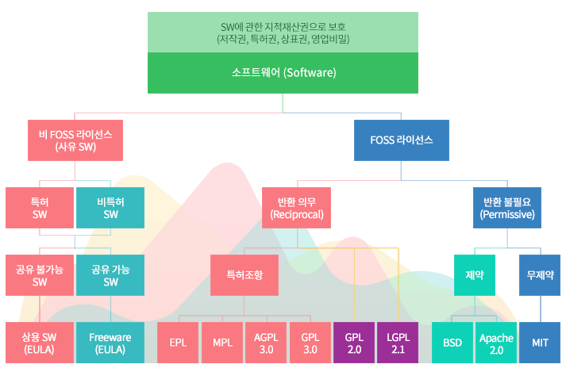
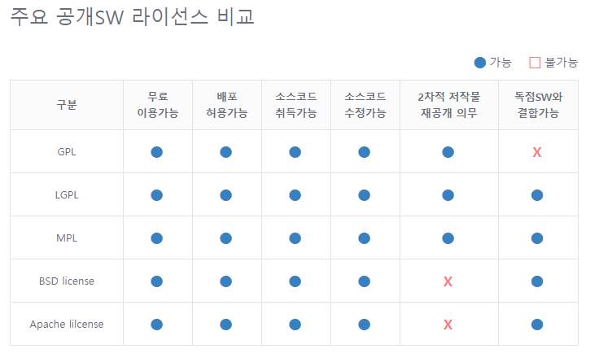
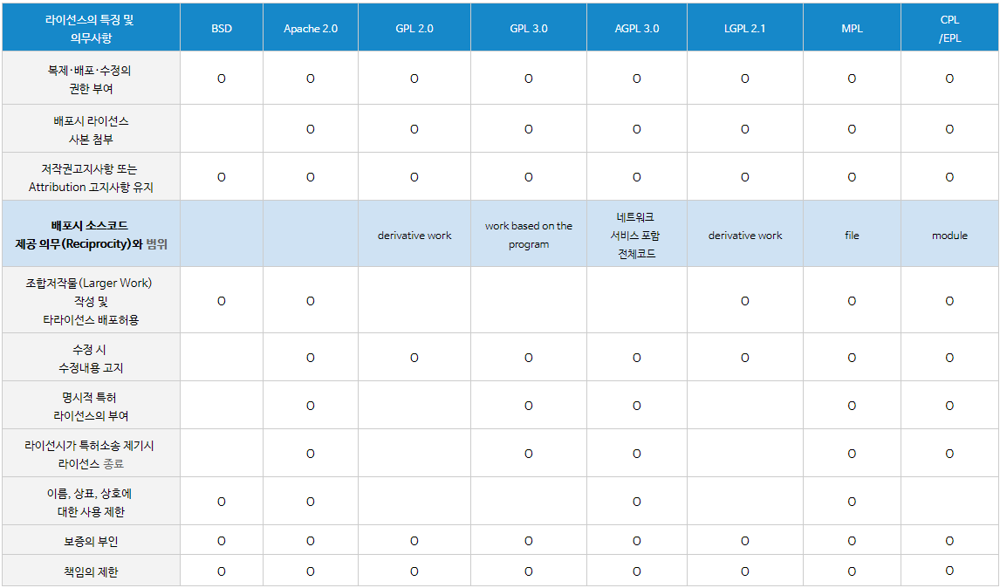

## AMI

- Amazon Machine Image

## VPC

- Virtual Private Cloud

## FaaS

- Functional as a Service

이중화/가용성(멀티 존으로 구성), 모니터링, snapshot/백업, api(DB같은 서비스는 cloud native하게 바로 접속 할 수 없게 만듬), 로드밸런서, 오토스케일, 서버 이전

- aws 리눅스 접속법 

  > `ssh -i\(pem 경로) ec2-user@ip주소`

`top` 명령

- linux에서 windows의 작업관리자 같은 명령어

## RDB vs NoSQL

- 조회냐 저장이냐의 차이
- 상품 정보 조회 - rdb
- Log 정보 저장 - nosql

## 서버리스??

- 서버가 필요없다는 의미가 아님
- 클라우드 사업자가 서버 운영과 관리를 모두 담당하여 서버의 존재를 인식하지 않아도 된다는 뜻
- API를 통해 어플리케이션을 연계하여 서버를 구현할 필요 없이 서비스가 제공 된다는 의미
- AWS의 Lambda 서비스

## Cloud Native Application 4개 구성요소

1. MSA
2. CI/CD
3. DevOps
4. Container

### API 정리

[2021-01-21](.\2021-01-21.md) 파일 참조

### Licence 종류 정리

> 출처 : [nipa(정보통신산업진흥원)](https://www.oss.kr/oss_license)

