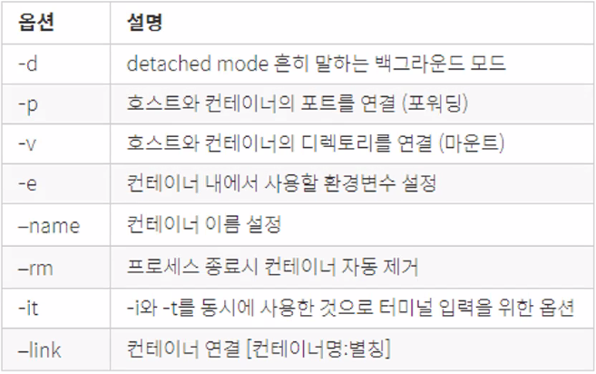

## 리눅스 컨테이너 장점

- cpu, 메모리를 필요한 만큼만 추가로 사용
- 성능 손실 거의 없음
- 컨테이너들 사이의 영향을 주지 않음
- 컨테이너 생성 속도 빠름(중요!)

### Docker Image

- 컨테이너 실행에 필요한 파일과 설정 값 등을 포함, 상태 값(이름, 암호...)은 실제로 가지고 있지 않음, 변경 불가

- 설치 파일

- Image가 실행되고 실체화, 사용, 설치된 것이 Container임

- 생성 혹은 public, private repo에서 다운로드 할 수 있음

- git과 비슷하게 `pull`을 통해 이미지 다운로드하여 도커 호스트에 저장

- `create`, `start`, `stop`

- `run`이 다운로드부터 실행까지 전부 해준다고 생각 - `pull + create + start`

  - `$ docker run [options]Image[:tag][@digest][command][arg...]`

  - 

- `pull`사용시 :뒤에 태그를 명시, 안해주면 최신버전 자동 다운로드 - `docker pull ubuntu:16.04`

### Volume mount

- 컨테이너를 삭제해도 Host os와 도커 엔진에 걸쳐 데이터가 저장되어 있고 이것을 연동하여서 향후 재 설치 후 mount만하면 재사용도 가능


### Layer 저장방식

- 유니온 파일 시스템을 이용하여 여러개의 레이어를 하나의 파일 시스템으로 이용 가능

## Dockerfile

- 이미지를 생성하기 위한 스크립트 파일, 생성 과정 기술한 파일

- from절로 시작 - base 이미지 지정(`계정/이미지 이름:tag`) ex) `FROM subicura/vertx3:3.3.1`
  - default : 계정 - docker , tag - latest
- maintainer - 유지보수자(이메일)
- add 뒤에 Dockerfile이 실행되고 있는 docker server에서의 directory위치에서 뒤에 띄어쓰기로 기술된 클라이언트에게 복사

### DSL(Domain-Specific language)

- 해당 도메인을 위한 새로운 문법


```powershell
PS C:\Users\Insolk> docker container ls
CONTAINER ID   IMAGE     COMMAND   CREATED   STATUS    PORTS     NAMES
PS C:\Users\Insolk> docker container create ubuntu:16.04
31607f5fec...
PS C:\Users\Insolk> docker container ls -al
CONTAINER ID   IMAGE          COMMAND       CREATED          STATUS    PORTS     NAMES
31607f5fecc3   ubuntu:16.04   "/bin/bash"   13 seconds ago   Created             ecsta..
PS C:\Users\Insolk> docker container start 31607f5fecc3
31607f5fecc3
PS C:\Users\Insolk> docker container ls -al
CONTAINER ID   IMAGE          COMMAND       CREATED         STATUS                      PORTS     NAMES
31607f5fecc3   ubuntu:16.04   "/bin/bash"   2 minutes ago   Exited (0) 43 seconds ago             ecsta..
// 바로 중지된 이유는 별다른 작업을 우분투에 적용해주지 않았기 떄문에 그냥 실행 후 바로 exit됨

PS C:\Users\Insolk> docker container run -it ubuntu:16.04 /bin/bash
// i - interactive(터미널 형태에서 키보드로 직접 입력), t - tty(리눅스 콘솔을 띄어줌), -it... /bin/bash - bash쉘 쓰겟다는 의미
// t만 치면 키보드로 아무리 입력해도 타이핑이 안됨, i만 치면 타이핑은 되는데 호스트에 명령어 전달이 안됨, 꼭 it로 쓰자
// 컨테이너 아이디가 os 호스트 이름이 됨
```


```powershell
PS C:\Users\Insolk> docker run -d -p 3306:3306 -e MYSQL_ALLOW_EMPTY_PASSWORD=true --name mysql mysql:5.7
// "-d : 백그라운드, -p : 포트포워딩/ex) 1111:2222-> 1111 - host(지금은 윈도우), 2222 - container, 호스트에서 컨테이너 안에 쓰려면 포트포워딩 해야함, -e : 환경설정"
ca4bb945bd...
PS C:\Users\Insolk> docker exec -it mysql /bin/bash
root@ca4bb945bd54:/# mysql -h127.0.0.1 -uroot -p //"#은 루트, $는 사용자" 
Enter password: "그냥 엔터, 초기값은 empty"

mysql> show databases;
mysql> create database mydb;
mysql> use mydb;
mysql> show tables;
mysql> create table member(id varchar(20), name varchar(20)); //테이블 생성
mysql> insert into member(id, name) values('user1', 'insol');
mysql> select * from member;
mysql> exit
root@ca4bb945bd54:/# exit

PS C:\Users\Insolk>
```

- `docker container inspect<컨테이너이름>` - 컨테이너의 상세정보 확인 가능
- `docker exec -it mysql_client mysql -h172.17.0.2 -uroot -p`이런 식으로 바로 명령실행도 가능
- MYSQL_RANDOM_ROOT_PASSWORD = true시 생성로그를 통해 랜덤 비밀번호를 알아낼 수 있음
- `-d`때문에 로그를 못봣다면 `docker logs<컨테이너 이름>`를 통해 **로그 확인** 할 수 있다
- 