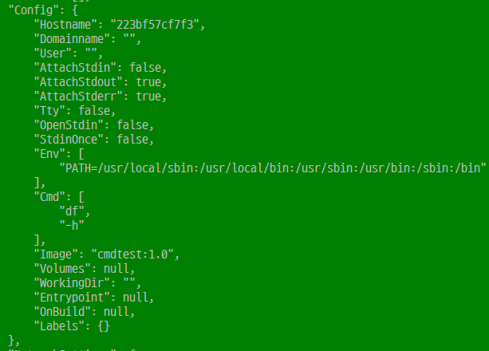
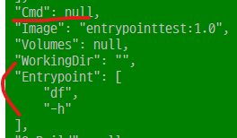
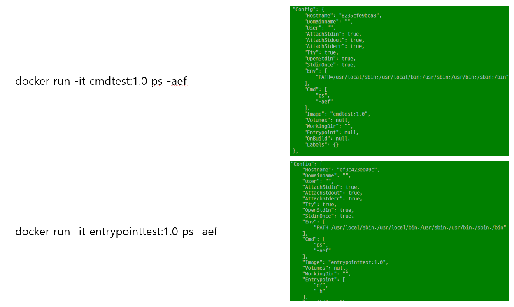

- id 지정할떄 앞 4개만 써도 그에 해당하는 모든 컨테이너 실행
- `docker container exec -it a1df /bin/bash -c mysql -h127.0.0.1 -uroot -p` bash쉘 안에서 파라미터 쓰러면 `-c`옵션 필수!
- `drop database <db이름>`
- `docker run -d -p 8888:8888 teamlab/pydata-tensorflow:0.1` - 텐서플로 도커 예시
- image 존재 여부 확인 후 없다면 docker hub에서 다운로드함


## Volume mount

- `/var/lib/mysql`리눅스 내에서 mysql이 저장되는 폴더

- `-v, --volume` 뒤에 host위치 : container위치 명시 ex)`--volume c:\~~:\var\lib\mysql`

  - ```powershell
    PS C:\work\docker_volume> docker run --volume :/var/lib/mysql  -d -p 13306:3306 -e MYSQL_ALLOW_EMPTY_PASSWORD=true --name mysql mysql:5.7
    ```

- `docker volume ls` - 호스트 pc의 볼륨 목록 출력

- `docker system prune` - 컨테이너, 이미지, 볼륨 중 사용 안하는거 초기화해줌


- `logs` 는 컨테이너에서만 사용가능
- `pull, push`는 이미지에서만 사용가능
- `ps`는 `ls`와 동일한 명령어


## Docker Image 생성

- Application File + Dockerfile

- 작업, 프로젝트 데이터 + DSL

- FROM절 - Base 이미지 지정

- `docker image build --tag fromtest:1.0 .` - 뒤의 점은 현재 디렉토리의 도커파일로 이미지 빌드하겟다는 뜻

- 같은 이름으로 버전을 바꿔서 빌드하면 자동으로 만들고 run시에 자동으로 컨테이너 업데이트도 됨

- ` docker container run -it fromtest:1.0`

- `copy .\Dockerfile .\Dockerfile_runtest`

- `--no_cache=true`를 통해 빌드시 캐시부분을 안하고 빌드 할 수 있음

- ```dockerfile
  FROM ubuntu:latest
  
  RUN mkdir /mydata
  ADD test.txt /mydata #순서 중요!!
  COPY test.txt /mydata/new_test.txt #이거도 사용가능
  
  #df -h
  CMD [ "df","-h" ]
  
  COPY test.sh /mydata/test.sh
  
  WORKDIR /mydata #작업 디렉토리 변경
  CMD ["./test.sh"] #디렉토리 전체 입력을 통한 실행은 상관없지만 해당 디렉토리에서 실행하려면 ./꼭 붙이기
  
  RUN echo "Hello, Docker!"
  ```

- add와 copy의 차이 - add는 파일 뿐만 아니라 uri값도 가능함, 파일만 하려면 copy사용하는 게 좋음
- cmd명령은 모두 기동된 후 쓰는 커맨드 명령어
- cmd명령에서 공백을 쓰기 위해 []안에 콤마로 구별
- entrypoint와 cmd기능은 동일, 변경되지 않는 고정적인 값은 entrypoint / 부가적인 파라미터 추가나 이후 변경될 수 있다면 cmd에 저장하는게 바람직
- <none> 이미지는 잘못 만들어졋거나 버전이 갱신된것이므로 rmi로 삭제해도 무방
- linux 에서 `ps -aef` 명령어로 프로세스 목록 확인 가능
- run exec 차이? - run은 새로 컨테이너 만들어서 실행, exec는 실행중인 컨테이너에 명령어 전달하여 사용
- 각각 cmd와 entrypoint 컨테이너의 inspect 비교
- 
- 
- cmd와 entrypoint에서 뒤에 추가로 명령어 `ps -aef`를 작성 하였을때 차이
- 

```shell
-------------------------- # test.sh

#!/bin/bash
# 사용하려는 명령어 해석기가 bash쉘임을 알려주는 부분
# 스크립트 파일에서 반드시 추가 해줘야하고 처음 #은 주석기호가 아님
ls
echo "Hello, Docker"
```

- 배포전에 local에서 테스트 후 도커파일 만들자
- 단계별로 우분투 깔고 테스트, 파이썬 깔고 테스트, 장고 깔고 테스트... 처럼 단계별로 잘 짜서 테스트 하자

## 도커에 node.js 프로젝트 만들기

1. base image 결정 (linux)
2. nodejs 설치 (npm 설치)
   - apt-get install nodejs
   - yum install nodejs
   - 그냥 노드배포판 hub에서 받아서 쓰자
3. index.js, package.json 파일 복사
4. npm install 명령어로 모듈 설치
5. npm start 명령어로 프로세스 실행

```dockerfile
FROM node:alpine #알파인엔 bash가 없어서 sh써야함!

WORKDIR /mydata
COPY ./package.json ./package.json
COPY ./index.js ./index.js

EXPOSE 8080
# run시에 -P 옵션을 통해 EXPOSE한 포트를 랜덤하게 호스트와 매칭 시켜줌
# 고정적인 작업시엔 -p : 명령을 통해 정해줌

RUN npm install

CMD ["npm", "start"]  # run과 cmd의 차이는 run은 도커 구축단계에서 환경 조성할 떄 사용하는 명령어로 컨테이너 생성 후 실행하기 위해 
					# cmd에 npm start를 걸어줌 안그러면 컨테이너 빌드 안에서 npm start가 구동되서 컨테이너 생성이 안됨! 중요!
CMD ["node", "--version"]

# CMD ["echo", "installed modules"]
```


```powershell
PS C:\work\docker_file\node_project> docker build -t mynodejs .
PS C:\work\docker_file\node_project> docker run mynodejs
PS C:\work\docker_file\node_project> docker tag mynodejs:latest mynodejs:1.0 // 1.0으로 새롭게 복사, 태그만 
PS C:\work\docker_file\node_project> docker tag mynodejs:latest insolk/mynodejs:1.0 // '/'앞에 계정명이 다르면 access deny뜸
PS C:\work\docker_file\node_project> docker login
Authenticating with existing credentials...
Login Succeeded
PS C:\work\docker_file\node_project> docker push insolk/mynodejs:1.0 //tag 명시안해주면 디폴트는 latest
The push refers to repository [docker.io/insolk/mynodejs]...
PS C:\work\docker_file\node_project> docker image rm -f 3f80 //겹치면 -f를 통해 강제로 삭제
PS C:\work\docker_file\node_project> docker image pull insolk/mynodejs:1.0
PS C:\work\docker_file\node_project> docker run -d -p 8080:8080 insolk/mynodejs:1.0
```

