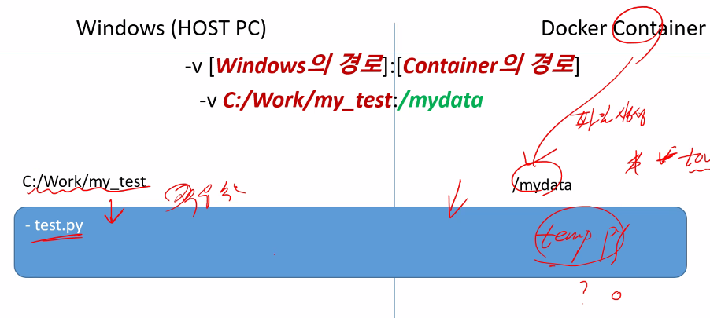
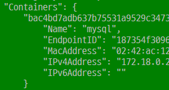
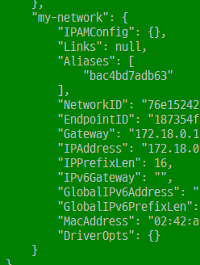

ENV 도커파일 환경변수 컨테이너 내부에서 사용할 수 있음

- echo $TZ하면 Asia/Seoul이 출력됨

- 윈도우 c:\users\insolk~~ \원
- 리눅스 /home/ubuntu/~~ /슬래시

- 파일 하나하나 바뀔때마다 이미지 생성 배포를 다시 해야되기 떄문에 volume을 권장한다
- 이미지 바꿀 필요 없고  volume내부만 바꿔주면 된다

```sh
docker run -e EXEC_FILE=test.py mypython
docker run -v C:\work\docker_file\python_project:/mydata -e EXEC_FILE=hello.py mypython ---> 볼륨 마운트와 동적 실행 동시 커맨드

docker run -d -p 13306:3306 -e MYSQL_ALLOW_EMPTY_PASSWORD=true --name mysql_client --network my-network mysql:5.7
--------------------------------//dockerfile 내용
CMD python ${EXEC_FILE}
```

- voiume mount 도식도(호스트, 컨테이너 둘 다 연동되는 개념)



## Docker  네트워크

- Bridge - 기본 네트워크 타입, 일반적으로 이거 사용

- host - 포트포워딩 없이 사용도 가능

- none, container ...

- `docker network ls`로 확인

- `docker network create my-network`로 생성, 디폴트 브릿지 타입으로 생성

- `docker network inspect my-network`로 정보 확인 

- 컨테이너 인스펙션에서도 확인 가능

  

- `docker network connect my-network mysql` connect뒤에 각각 네트워크, 컨테이너 이름 적기

- `172.18.0.3/16` 16은 CIDA로 하위 2개만 주소 바꿀 수 있다는 뜻

- `hostname -i`으로 ip주소 확인 가능

- `mysql -hmysql -uroot -p`처럼 컨테이너 이름으로도 로그인 가능

- `docker container stats` 컨테이너 현황 확인 가능
- `docker network disconnect my-network mysql_client`
- `docker network rm my-network` 으로 삭제 가능
- 처음부터 `--network`옵션을 통해 네트워크를 지정하여 컨테이너를 생성 했다면 네트워크 삭제 이후 다른 네트워크로 지정해줘야 한다. --> `docker network connect bridge mysql_client`
- 아니라면 자동으로 디폴트 브릿지 네트워크로 전환됨


## django 프로젝트 Docker에 연동하기

```python
DATABASES = {
    'default': {
        # 'ENGINE': 'django.db.backends.sqlite3',
        # 'NAME': os.path.join(BASE_DIR, 'db.sqlite3'),
        'ENGINE': 'django.db.backends.mysql',
        'NAME': 'mydb',
        'USER': 'root',
        'PASSWORD': '',
        'HOST': '127.0.0.1',
        'PORT': 3306

    }
} #------ settings.py sqlite 지우고 mysql로 갱신
# 이후 python manage.py makemigrations ==> migrate
# python manage.py createsuperuser
```

```dockerfile
FROM django

WORKDIR /mydata

COPY django_src /mydata/ -->directory 연결시
-----------------------------------------------
FROM python:3.7.9-stretch

RUN pip install django
RUN pip install djangorestframework
RUN pip install scrapy
RUN pip install mysqlclient

WORKDIR /mydata

COPY django_src /mydata/

RUN python manage.py makemigrations
RUN python manage.py migrate

CMD ["python","manage.py","runserver", "--noreload"]
```

`docker run -v C:\work\docker_file\django_new:/mydjango -it -P mydjango`