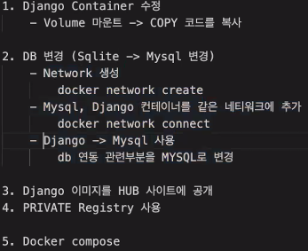

- volume이 아닌  copy로 복사 했을 떄는 컨테이너 내부로 들어가 코드를 변경할 수 밖에 없음, exec <컨테이너 id>를 이용해서 실행되어 있는 컨테이너로 들어가자!

- copy시에 폴더 하나하나씩 복사하는게 좋을 거 같음
- powershell에서 tree 명령어 쓰기, 파일 구조가 출력됨, 리눅스에도 있음

- `django.db.utils.OperationalError: (2005, "Unknown MySQL server host 'mysql_server' (-2)")` 오류 - 같은 도커 네트워크에 묶여있지 않아서 생긴 문제, 하나로 묶어주자

- [mysql 공식 도커 이미지](https://hub.docker.com/_/mysql)의 Environment Variables처럼 run시에 -e와 함께 옵션을 걸어 줄 수 있기 때문에 잘 참고하자!



- 참고할 수 있는 **최종** 도커파일 및 커맨드, py 파일

```dockerfile
FROM python:3.7.9-stretch

RUN apt-get update
RUN pip install django
RUN pip install mysqlclient
RUN apt-get install -y vim

WORKDIR /mydjango
COPY mybookmark /mydjango/mybookmark
COPY bookmark /mydjango/bookmark
COPY mysite /mydjango/mysite
COPY manage.py /mydjango/manage.py
COPY db.sqlite3 /mydjango/db.sqlite3

# RUN python manage.py makemigrations
# RUN python manage.py migrate

EXPOSE 8000

CMD ["python","manage.py","runserver","0.0.0.0:8000"]
------------django 이미지

------------mysql 이미지
FROM mysql:5.7

ENV MYSQL_ALLOW_EMPTY_PASSWORD=true
ENV MYSQL_DATABASE mydb
EXPOSE 3306

CMD ["mysqld"]
```

```powershell
PS C:\work\docker_file\django_new\db_mount> docker network create my_network
PS C:\work\docker_file\django_new\db_mount> docker network connect my_network 4d7...
PS C:\work\docker_file\django_new\db_mount> 
docker run 
-d 
-p 13306:3306 
-e MYSQL_ALLOW_EMPTY_PASSWORD=true 
-v C:\work\docker_file\django_new\db_mount:/var/lib/mysql 
--network my_network 
--name mysql_server mysql:5.7
PS C:\work\docker_file\django_new> docker tag mydjango:latest insolk/mydjango:mysql
PS C:\work\docker_file\django_new> docker push insolk/mydjango:mysql
```

```python
DATABASES = {
    'default': {
        # 'ENGINE': 'django.db.backends.sqlite3',
        # 'NAME': os.path.join(BASE_DIR, 'db.sqlite3'),
        'ENGINE': 'django.db.backends.mysql',
        'NAME': 'mydb',
        'USER': 'root',
        'PASSWORD': '',
        'HOST': 'mysql_server',
        'PORT': 3306
    }
}
```

- mysql vs mysqld
  - **mysqld**는 백그라운드에서 돌아가고 있는 프로세스, MYSQL 서버
  - **mysql**은 우분투의 터미널처럼 *sql*문을 실행시켜주는 command-line client

