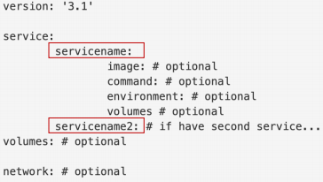
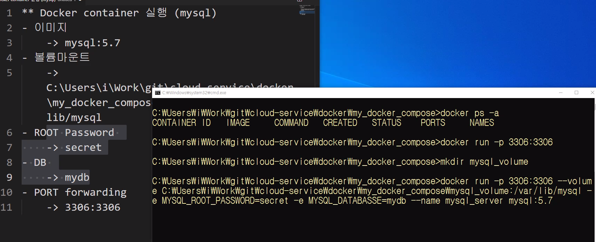
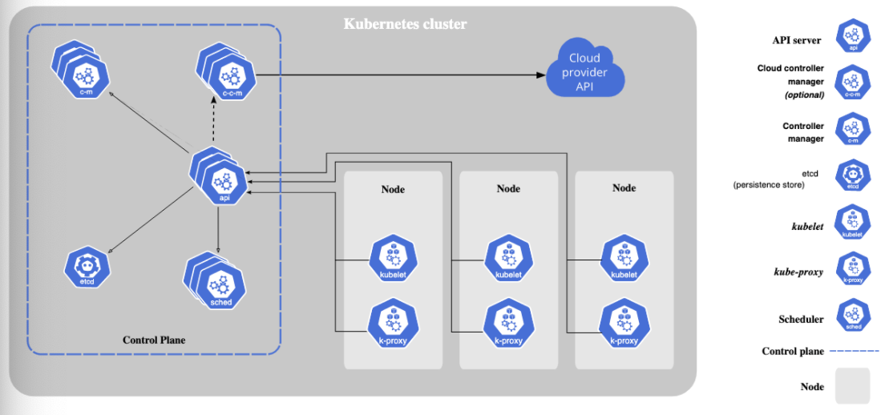

## docker compose

- docker 커맨드 or 복잡한 설정을 쉽게 관리하기 위한 도구
- YAML format에 Docker 생성, 설정 관련된 작업을 작성해 놓은 script 파일
- 들여쓰기를 통해 커맨드를 구별, 2, 4칸 탭키 상관없이 그냥 들여쓰기로 구별
- docker-compose up으로 실행, down으로 종료 yml파일 디렉토리에서 명령 실행해줘야함
- docker compose예시
- 
- 

```yaml
version: "3.9"
services:
  my-mysql:
    image: mysql:5.7
    volumes:
      - ./mydal-data:/var/lib/mysql
    ports:
      - 3306:3306
    environment:
      MYSQL_ROOT_PASSWORD: secret
      MYSQL_DATABASE: mydb
```

- 컴포즈 파일에선 로컬에 이미지가 있어야 실행 할 수 있는 듯?
- 강제종료하면 리소스 해제가 잘 안될 수 있기 때문에 가급적 down을 이용해서 삭제하는게 좋음

```yaml
version: "3.9"
services:
  my-mysql:
    container_name: mysql_server
    image: insolk/mymysql:bookmark
    # volumes:
    #   - ./mydal-data:/var/lib/mysql
    # deploy:
    #   replicas: 2
    ports:
      - 3306:3306
    environment:
      MYSQL_DATABASE: mydb
    networks:
      - my-network
  my-django:
    image: insolk/mydjango:bookmark
    ports:
      - 8000:8000
    depends_on:
      - my-mysql
    networks:
      - my-network
networks: 
  my-network:
```

- deploy에서 replicas 숫자를 지정해서 여러개 서버 추가가 가능함
- 도커만 사용시에 사용하는 방법으로 쿠버네틱스를 통해 관리가 가능한 부분이다.

## 쿠버네틱스

- k8s - 쿠버네틱스의 줄임말, 사이에 8글자가 있다는 뜻
- kubectl 통해 명령행 실행



- Control Plane = master node(1개)

- node = worker node(3개)
- vagrant init, up, status, ssh

- Vagrantfile

  ```
  Vagrant.configure("2") do |config|
    config.vm.box = "centos/7"
  end
  ```

  

- 블로킹 서버 - 한 프로그램이 서버를 점유하고 있으면 끝날때 까지 다른 작업을 할 수 없는 서버를 뜻함