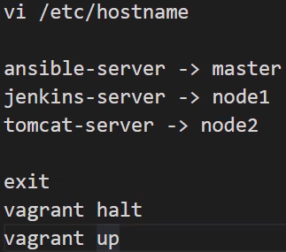
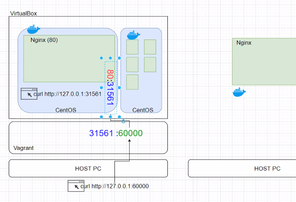
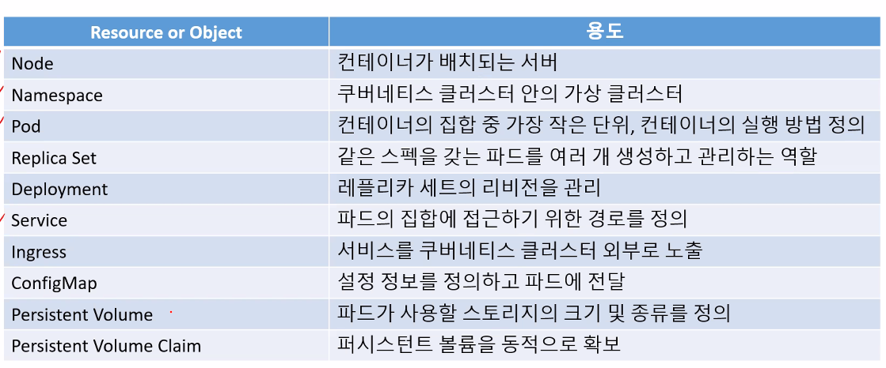

- vagrant를 통해 가상화 os를 쉽게 깔 수 있음
- 오케스트레이션 툴을 이용하여 여러 컨테이너를 쉽게 관리
- `Vagrant init / up / halt / status / destroy / ssh / reload`
- 

- `vagrant ssh-config master`을 통해 포트와 유저이름, 암호파일 디렉토리 확인 후 shell 프로그램에서 사용 가능
- hosts파일을 수정하면 dns사용하듯이 ip주소를 이름과 매칭시켜서 사용할 수 있음
- master == control plane - 모든 작업은 마스터에서만 함, 노드에선 딱히 할 거 없음
- 작업할수있는 공간 - namespace
- 컨테이너가 구성될 수있는 최소한의 단위 - pod
- nodeport?? - 외부에서 사용할 수 있도록 서비스 타입을 변경

