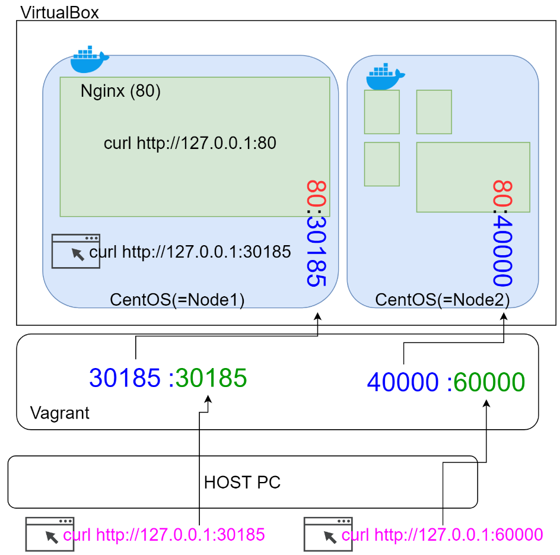

- `systemctl start kubelet`을 통해 안켜져 있으면 서비스 실행 해야함
- `systemctl status kubelet`으로 상태 확인
- `kubectl get nodes, pods, services`
- clusterIP - 클러스터 내부에서만 쓸 수 있게 설정
- NodePort - 클러스터 외부에서도 사용 할 수 있도록 설정
- `kubectl get pods -o wide`을 통해 어떤 노드에 설치 되었는지 확인 가능
- kubectl은 마스터에서만 쓸 수 있음, 노드에선 거절됨
- `docker ps | grep nginx-test`을 노드에서 확인해서 잘 실행 중인지 확인
- `kubectl describe pod nginx-test`
- `cfg.vm.network "forwarded_port", guest: 31020, host: 31020` - vagrant port_forwarding
- 

- `kubectl get pods -o wide -n kube-system`로 시스템 pod확인
- apiVersion, kind, metadata, spec 중요! / namespace, node, pod, service
- [apiversion 참고](https://honggg0801.tistory.com/45)
- [쿠버네티스 공식문서](https://kubernetes.io/docs/home/)
- `kubectl get pods nginx-test -o yaml > nginx_pod.yml`존재하는 파드에서 내부 yaml내용 끌어내고 싶을 때 사용, 서비스도 동일하게 사용가능

```yaml
apiVersion: v1
kind: Service
metadata:
  name: my-service
spec:
  selector:
    app: MyApp -> 별명같은 느낌
  ports:
    - protocol: TCP
      port: 80 -> 외부 포워딩 포트
      targetPort: 9376 - 컨테이너 보유 포트
  service 예시
```

```yaml
apiVersion: batch/v1
kind: Job
metadata:
  name: hello
spec:
  template:
    # This is the pod template
    spec:
      containers:
      - name: hello
        image: busybox
        command: ['sh', '-c', 'echo "Hello, Kubernetes!" && sleep 3600']
      restartPolicy: OnFailure
    # The pod template ends here
pod 예시
```

- 단계별로 쿠버네티스 구축 해야함, 먼저 베어메탈 로컬에서 잘 돌아가야함, 그 다음 도커를 통해 실행 잘되는지 확인

- node 설치 in Centos
  1. yum install epel-release
  2. yum install -y gcc-c++ make
  3. curl -sL https://rpm.nodesource.com/setup_12.x | sudo -E bash -
  4. yum install nodejs

- `kubectl apply` - apply a configuration to a resource by filename or stdin
  - `kubectl apply -f my_hello_pod.yml `
- `kubectl create` - create a resource from a file or from stdin / run....

```bash
[root@master node_project]# kubectl get pods
NAME         READY   STATUS              RESTARTS   AGE
hello-pod    0/1     ContainerCreating   0          9s
nginx-test   1/1     Running             1          5h17m

[root@master node_project]# kubectl get all
NAME             READY   STATUS              RESTARTS   AGE
pod/hello-pod    0/1     ContainerCreating   0          21s
pod/nginx-test   1/1     Running             1          5h18m

NAME                 TYPE        CLUSTER-IP       EXTERNAL-IP   PORT(S)        AGE
service/kubernetes   ClusterIP   10.96.0.1        <none>        443/TCP        3d2h
service/nginx-test   NodePort    10.107.245.158   <none>        80:31020/TCP   5h17m

[root@master node_project]# kubectl get pod --namespace default
NAME         READY   STATUS    RESTARTS   AGE
hello-pod    1/1     Running   0          112s
nginx-test   1/1     Running   1          5h19m
[root@master node_project]# kubectl describe pod hello-pod
[root@master node_project]# kubectl exec -it hello-pod bin/bash

```

- service 예시

  ```yaml
  apiVersion: v1
  kind: Service
  metadata:
    name: hello-service
  spec:
    selector:
      app: hello
    ports: # -p 8001:8000
    - port: 8001 # 외부 포트
      targetPort: 8000 # 컨테이너 포트
    type: NodePort
  ```

- pod 예시

  ```yaml
  apiVersion: v1
  kind: Pod
  metadata:
    name: pod-1
  spec:
    containers:
      - name: container1
        image: kubetm/p8000
        ports: 
          - containerPort: 8000
      - name: container2
        image: kubetm/p8080
        ports: 
          - containerPort: 8080
  ```

  - curl로 포트 확인전 로컬에서 확인해보자
  
  ```bash
  [root@master node_project]# kubectl delete pod/hello-pod
  pod "hello-pod" deleted
  [root@master node_project]# kubectl delete service/hello-service
  service "hello-service" deleted
  [root@master node_project]# docker build -t insolk/hello:2.0 .
  
  [root@master node_project]# docker push insolk/hello:2.0
  
  [root@master node_project]# docker ps -a | grep hello
  [root@master node_project]# docker run -d -p 8001:8000 insolk/hello:2.0
  [root@master node_project]# curl -X GET 127.0.0.1:8001
  ---마스터 도커 초기화
  [root@master node_project]# kubectl apply -f my_hello_pod.yml
  [root@master node_project]# kubectl get pods -o wide
  ---해당 노드 실행
  [root@node1 ~]# docker exec -it 컨테이너 실행 bash
  root@hello-pod:/# apt-get update && apt-get install curl
  root@hello-pod:/# curl -X GET 127.0.0.1:8000
  Hello Kubernetes for k8s!
  ---테스트 완료 후 마스터로
  [root@master node_project]# kubectl apply -f my_hello_svc.yml 
  [root@master node_project]# kubectl get service -o wide 로 포트 확인
  [root@master node_project]# curl -X GET 127.0.0.1:30188
  Hello Kubernetes for k8s!
  ```
  
  - docker 수정할 때 태그로 꼭 구별해주자