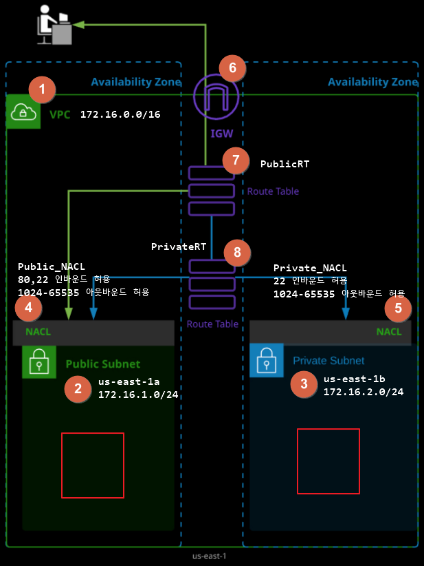

참고: 스웜을 이용한 실전 애플리케이션 개발 실습
[링크1/](https://myanjini.tistory.com/entry/%EC%8A%A4%EC%9B%9C%EC%9D%84-%EC%9D%B4%EC%9A%A9%ED%95%9C-%EC%8B%A4%EC%A0%84-%EC%95%A0%ED%94%8C%EB%A6%AC%EC%BC%80%EC%9D%B4%EC%85%98-%EA%B0%9C%EB%B0%9C-1)[링크2/](https://myanjini.tistory.com/entry/스웜을-이용한-실전-애플리케이션-개발-2)[링크3](https://myanjini.tistory.com/entry/스웜을-이용한-실전-애플리케이션-개발-3)/[링크4](https://myanjini.tistory.com/entry/스웜을-이용한-실전-애플리케이션-개발-4)

- Amazon S3 
  - 객체 기반의 무제한 파일 저장 스토리지
  - 99.999999999% 내구성
  - 사용한 만큼만 지불 (GB 당 과금)객체 URL을 통해 쉽게 파일을 공유
  - 정적 웹 사이트 호스팅 가능
- Amazon Glacier
  - 99.999999999% 내구성
  - 아카이브 및 백업 용도
  - S3 대비 1/5 비용

- 서버리스 아키텍처 간단 구조

- 리전
  - AWS 서비스가 운영되는 지역
  - 복수개의 데이터 센터들의 집합
  - https://aws.amazon.com/ko/about-aws/global-infrastructure/
- 가용영역(AZ)
  - 리전 내에 위치한 데이터 센터
  - 물리적으로 분리되어 있음 → 고가용성을 보장하기 위해 
- VPC(Virtual Private Cloud)
  - AWS 계정 전용 가상 네트워크
  - 한 AWS 리전 안에서만 존재할 수 있고, 한 리전에 만든 VPC는 다른 리전에서는 보이지 않음
  - 연속적인 IP 주소 범위로 구성 ⇒ CIDR 블록으로 표시
    - 10.0.0.0/8		→ 10.0.0.0 ~ 10.255.255.255
    - 172.16.0.0/12		→ 172.16.0.0 ~ 172.31.255.255
    - 192.168.0.0/16		→ 192.168.0.0 ~ 192.168.255.255
- 서브넷(subnet)
  - VPC 내 논리 컨테이너 
  - EC2 인스터스를 배치하는 장소 ⇒ 인스턴스는 서브넷 안에 위치
    - 서브넷에 인스턴스를 생성하면 다른 서브넷으로 이동할 수 없음
    - 인스턴스를 종료하고 다른 서브넷에 새 인스턴스를 생성
  - 인스턴스를 서로 격리하고, 인스턴스 간의 트래픽 흐름을 제어하고, 인스턴스를 기능별로 묶을 수 있음
  - 서브넷 CIDR 블록
    - VPC의 일부, VPC 내에서는 유니크해야 함
    - 모든 서브넷에서 처음 4개의 IP와 마지막 1개는 예약되어 있으므로 인스턴스에 할당할 수 없음
    - 예) 서브넷 CIDR가 171.16.100.0/24인 경우 → 172.16.100.0 ~ 172.16.100.3와 172.16.100.255 
  - 서브넷은 **하나의 가용 영역(AZ)** 내에서만 존재할 수 있음
  - [CIDR 설명 및 출처](https://kim-dragon.tistory.com/9)

- ENI(Elastic Network Interface, 탄력적 네트워크 인터페이스) 
  - 물리 서버의 NIC(Network Interface Controller)와 같은 기능을 수행
  - 모든 인스턴스에는 기본 ENI가 존재하며, 이 인터페이스는 하나의 서브넷에만 연결
- IGW(Internet Gateway, 인터넷 게이트웨이)
  - 퍼블릿 IP 주소를 할당받은 인스턴스가 인터넷과 연결되어서 인터넷으로부터 요청을 수신할 수 있도록 해 주는 서비스
  - 처음 VPC를 생성하더라도 IGW가 연결되지는 않음 ⇒ 직접 IGW를 생성하고 VPC와 연결해야 함
  - VPC는 하나의 IGW만 연결 가능
- 라우팅 테이블 
  - VPC는 소프트웨어 함수로 IP 라우팅을 구현한 라우터를 제공 ⇒ 사용자는 라우팅 테이블만 관리
  - 라우팅 테이블은 하나 이상의 라우팅과 하나 이상의 서브넷 연결로 구성
  - VPC를 생성하면 기본 라우팅 테이블을 자동으로 만들고 해당 VPC의 모든 서브넷과 연결
- 라우팅
  - 라우팅 테이블과 연결된 서브넷 내 인스턴스에서 트래픽을 전달하는 방법을 결정
  - 라우팅 테이블에는 같은 VPC에 있는 인스턴스 간에 통신할 수 있게 하는 **로컬 라우팅**이 필수적으로 포함
  - **기본 라우팅**
    - 인스턴스가 인터넷에 액세스하게 하려면 IGW를 가리키는 기본 라우팅을 생성해야 함
      - 대상(target) 주소 : **0.0.0.0/0**	**⇐ 인터넷 상의 모든 호스트의 IP 주소**
      - 대상		  : igw-xxxx...
  - 퍼블릿 서브넷 : IGW를 가리키는 기본 라우팅이 포함된 라우팅 테이블과 연결된 서브넷
  - 프라이빗 서브넷 : 기본 라우팅이 포함되어 있지 않음
  - 라우팅을 결정할 때는 가장 근접하게 일치하는 항목을 기반으로 라우팅
    - 대상 주소			대상
    - 172.31.0.0/16			LOCAL
    - 0.0.0.0/0			igw-xxxx…
    - 198.51.100.50으로 패킷을 보낼려고 하면, IGW로 패킷을 전달
    - 172.31.0.10으로 패킷을 보낼려고 하면, 172.31.0.10으로 패킷을 전달
- 보안 그룹 (Security Group)
  - 방화벽과 같은 기능 제공
    - 상태 저장 방화벽 역할
    - 보안 그룹이 트래픽을 한 방향으로 전달되도록 허용할 때 반대 방향의 응답 트래픽을 지능적으로 허용
  - 인스턴스의 ENI에서 송수신되는 트래픽을 허가해서 인스턴스를 오가는 트래픽을 제어
  - 모든 ENI는 최소 하나 이상의 보안 그룹과 연결되어야 함
    - 보안 그룹과 ENI는 N:N 관계
  - 보안 그룹 생성 시 보안 그룹 이름, 설명, 포함될 VPC를 지정하고, 보안 그룹 생성 후에 인바운드, 아웃바운드 규칙을 지정해서 트래픽을 제어
- NACL(Network Access Control List)
  - 보안 그룹과 유사
    - 원본(source)/대상(target) 주소 CIDR, 프로토콜, 포트를 기반으로 트래픽을 허용하는 인바운드, 아웃바운드 규칙을 포함 ⇒ 방화벽 기능
    - VPC에는 삭제할 수 없는 기본 NACL이 존재
  - NACL은 ENI가 아닌 서브넷에 연결, 해당 서브넷과 송수신하는 트래픽을 제어
    - 서브넷 내의 인스턴스 간 트래픽을 제어할 때는 NACL을 사용할 수 없음 ⇒ 보안 그룹
  - NACL은 상태를 저장하지 않음 = NACL은 통과하는 연결 상태를 추적하지 않음
    - 모든 인바운드, 아웃바운드 트래픽의 허용 규칙을 별도로 작성해야 함
  - NACL 규칙은 규칙 번호의 오름차순으로 처리
- 
- NACL에 인바운드/아웃바운드 규칙을 추가 ⇐ 해당 서브넷에서 제공하는 서비스와 관리를 위한 서비스(SSH, 22)를 고려
- DMZ*public ⇒ 웹 서버 (80)
- AppLayer*private ⇒ express.js (3000)
- DBLayer*private ⇒ MySQL (3306)

