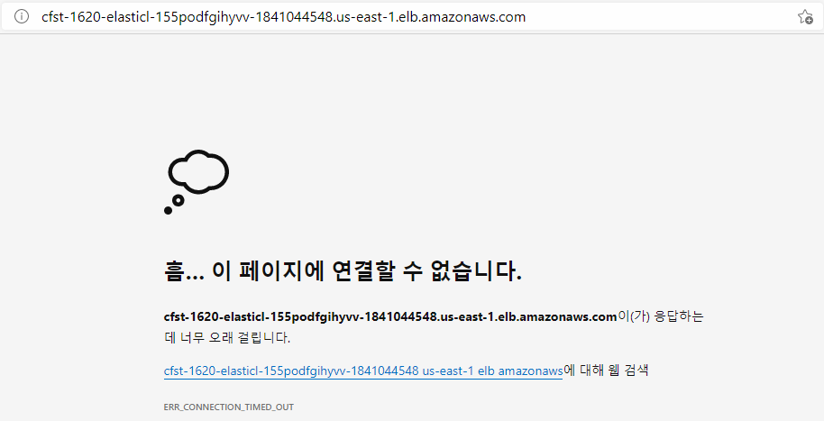
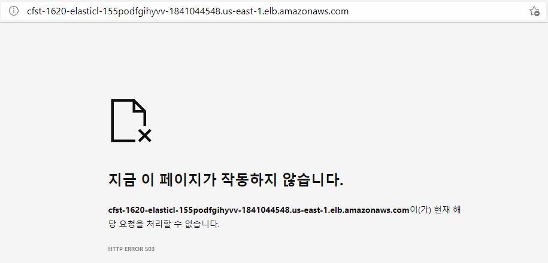
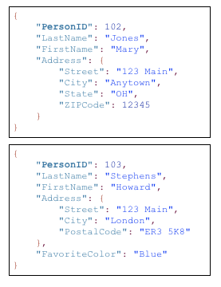

- 서비스 포트가 유효하지 않기 때문에 연결 할 수 없음
- 포트를 열어 유효한 연결 만들어줘야 함
- 포트가 안되는거 뿐만 아니라 방화벽에서 차단도 고려
- security group, NACL확인

- 연결은 되었지만 서비스가 되지않는 중
- 인스턴스들의 상태 확인해 봐야함

- DynamoDB
- 

[python db예제](https://aws.amazon.com/ko/getting-started/hands-on/create-manage-nonrelational-database-dynamodb/)

[boto3 reference](https://boto3.amazonaws.com/v1/documentation/api/latest/reference/services/dynamodb.html)