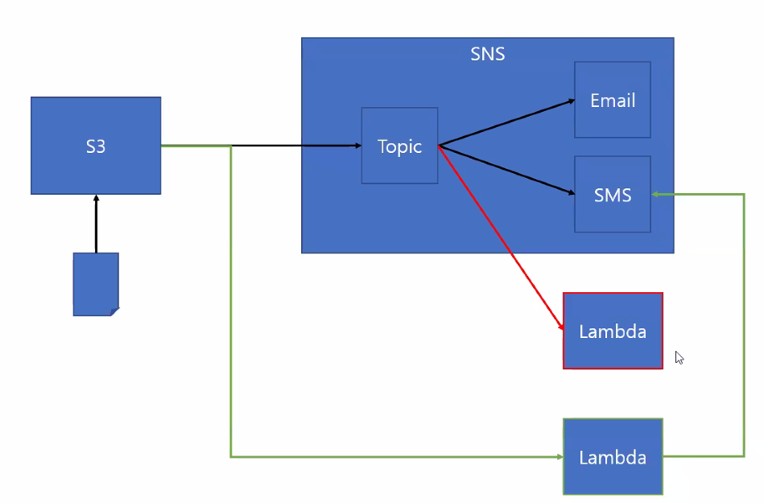

```python
import json

def lambda_handler(event, context):
    # TODO implement
    message = json.dumps(event["Records"][0]["s3"]["object"]["key"])
    print(type(message))
    print ("file name : " + message)
    return {
        'statusCode': 200,
        'body': json.dumps(event['Records'][0])
    }
```

- keyerror:'s3'는 진짜 키가 없어서 생긴 문제인 것 같음
- s3 버킷 이벤트 설정에 **직접 가서** lambda 추가하기
- 서비스에 따라 메세지 내용이 달라진다는 것이 중요
- sns이벤트 처리 대상을 sns topic으로 하냐, lambda로 하냐가 차이점이 있음
- 

- 아래 그림과 같이 미리 데이터를 전처리해서 보낼 수 있게 됨
- boto3 공식문서 참조하기 (topicArn)


## SQS 

- 맨 처음 개발 되었을 때 비동기 시스템에서 work를 큐에 넣어줌으로써 수행할 수 있도록 돕는 역할
- 큐 서비스를 모니터링 하면서 제대로 진행 되고 있는지 확인 가능

### Queue

- 메시지를 담는 공간
- 리전 별로 생성해야 함
- HTTP 프로토콜을 이용해서 다른 리전끼리 메세지를 주고 받을 수 있음
- 큐 이름은 모든 리전에서 유일해야 함
- 큐에 담을 수 있는 메시지의 개수는 무제한
- 연속해서 30일 동안 아무런 요청이 발생하지 않으면 AWS가 큐를 삭제
- 같은 리전 안에서의 데이터 전송은 무료
- 다른 리전에 있는 인스턴스와 메시지를 주고 받으면 데이터 요금이 과금

### Message

- XML 또는 JSON 형태
- 최대 256KB
- 유니코드 문자 사용 가능
- 초 단위로 보관 기간 설정이 가능
- 고유한 ID가 부여됨
- 3 ~ 4KB의 작은 메시지도 256KB로 책정 ⇒ 용량이 작은 메시지를 개별적으로 처리하는 것 보다는 메시지를 모아서 배치 API로 처리하는 것이 요금 효율적

### Batch API

- 한번에 최대 10개의 메시지(최대 256KB까지)를 동시에 처리


### Visibility Timeout

- 메시지를 받은 뒤 특정 시간 동안 다른 곳에서 동일한 메시지를 다시 꺼내 볼 수 있게 또는 없게 하는 기능
- 큐 하나에 여러 서버에 메시지를 받을 때 동일한 메시지를 동시에 처리하는 것을 방지
- Message Avaliable (Visible) ⇒ 메시지를 꺼내서 볼 수 있는 상태의 메시지 개수
- Message in Fight (Not Visible) ⇒ 다른 곳에서 메시지를 보고 있어 현재 볼 수 없는 메시지의 개수


### Delay Delivery

- 특정 시간 동안 메시지를 받지 못하게 하는 기능
- 지연되는 시간 동안에는 Message in Fight에 포함

### Dead Letter Queues

- 일반적으로 메시지를 받고 작업이 완료되면 메시지를 삭제하는데, 
- 설정한 회수를 초과하여 메시지를 받았는데 삭제되지 않고 남아 있으면 처리 실패 큐로 보냄
- 일반 큐 하나에 여러 처리 실패 큐를 연결할 수 있으며, 일반 큐와 처리 실패 큐는 같은 리전에 있어야 함

### Short Polling

- 메시지 받기 요청을 하면 결과를 바로 받음
- 메시지가 있으면 메시지를 가져오고 없으면 빠져 나옴
- ReceiveMessage 요청에서 WaitTimeSeconds를 0으로 했을 때
- Queue 설정의 ReceiveMessageWaitTimeSeconds를 0으로 했을 때

### Long Polling

- 메시지가 있으면 바로 가져오고 없으면 올 때까지 기다림
- 1초부터 20초까지 설정이 가능 (기본은 20초)
- ReceiveMessage 요청에서 WaitTimeSeconds를 0 보다 크면 큐 설정의 ReceiveMessageWaitTimeSeconds 값 보다 우선으로 처리


- fifo 큐가 아닌 standard 큐를 사용하여 알림이 무작위로 보내짐

```python
#create_queue() 
#https://boto3.amazonaws.com/v1/documentation/api/latest/reference/services/sqs.html#SQS.Client.create_queue
response = client.create_queue(
    QueueName='string',
    Attributes={
        'string': 'string'
    },
    tags={
        'string': 'string'
    }
)
#DelaySeconds – The length of time, in seconds, for which the delivery of all messages in the queue is delayed. Valid values: An integer from 0 to 900 seconds (15 minutes). Default: 0.
#MessageRetentionPeriod – The length of time, in seconds, for which Amazon SQS retains a message. Valid values: An integer from 60 seconds (1 minute) to 1,209,600 seconds (14 days). Default: 345,600 (4 days).

```

```python

import boto3
import time
from sqs_url import QUEUE_URL

sqs = boto3.client('sqs')

i = 0

while i < 100000:
    i = i + 1
    time.sleep(1)
    response = sqs.get_queue_attributes(
        QueueUrl=QUEUE_URL,
        AttributeNames=[
            'ApproximateNumberOfMessages',
            'ApproximateNumberOfMessagesNotVisible',
            'ApproximateNumberOfMessagesDelayed',
        ]
    )
    for attribute in response['Attributes']:
        print(
            response['Attributes'][attribute] +
            ' ' +
            attribute
        )
    print('')
    print('')
    print('')
    print('')


#get_queue_attributes
#https://boto3.amazonaws.com/v1/documentation/api/latest/reference/services/sqs.html#SQS.Client.get_queue_attributes
#response = client.get_queue_attributes(
   # QueueUrl='string',
    #AttributeNames=[
        #'All'|'Policy'|'VisibilityTimeout'|'MaximumMessageSize'|'MessageRetentionPeriod'|'ApproximateNumberOfMessages'|'ApproximateNumberOfMessagesNotVisible'|'CreatedTimestamp'|'LastModifiedTimestamp'|'QueueArn'|'ApproximateNumberOfMessagesDelayed'|'DelaySeconds'|'ReceiveMessageWaitTimeSeconds'|'RedrivePolicy'|'FifoQueue'|'ContentBasedDeduplication'|'KmsMasterKeyId'|'KmsDataKeyReusePeriodSeconds'|'DeduplicationScope'|'FifoThroughputLimit',
  #  ]
#)

#ApproximateNumberOfMessages – Returns the approximate number of messages available for retrieval from the queue.
#ApproximateNumberOfMessagesDelayed – Returns the approximate number of messages in the queue that are delayed and not available for reading immediately. This can happen when the queue is configured as a delay queue or when a message has been sent with a delay parameter.
#ApproximateNumberOfMessagesNotVisible – Returns the approximate number of messages that are in flight. Messages are considered to be in flight if they have been sent to a client but have not yet been deleted or have not yet reached the end of their visibility window.

```

```python
# slow_producer.py
import boto3
import json
import time
from sqs_url import QUEUE_URL

# Create SQS client
sqs = boto3.client('sqs')

with open('slow_data.json', 'r') as f:
    data = json.loads(f.read())

for i in data:
    msg_body = json.dumps(i)
    response = sqs.send_message(
        QueueUrl=QUEUE_URL,
        MessageBody=msg_body,
        DelaySeconds=10,
        MessageAttributes={
            'JobType': {
                'DataType': 'String',
                'StringValue': 'NewDonor'
            },
            'Producer': {
                'DataType': 'String',
                'StringValue': 'Slow'
            }
        }
    )
    print('Added a message with 10 second delay - SLOW')
    print(response)
    time.sleep(1)


# send_message
# https://boto3.amazonaws.com/v1/documentation/api/latest/reference/services/sqs.html#SQS.Client.send_message

# response = client.send_message(
#     QueueUrl='string',
#     MessageBody='string',
#     DelaySeconds=123,
#     MessageAttributes={
#         'string': {
#             'StringValue': 'string',
#             'BinaryValue': b'bytes',
#             'StringListValues': [
#                 'string',
#             ],
#             'BinaryListValues': [
#                 b'bytes',
#             ],
#             'DataType': 'string'
#         }
#     },
#     MessageSystemAttributes={
#         'string': {
#             'StringValue': 'string',
#             'BinaryValue': b'bytes',
#             'StringListValues': [
#                 'string',
#             ],
#             'BinaryListValues': [
#                 b'bytes',
#             ],
#             'DataType': 'string'
#         }
#     },
#     MessageDeduplicationId='string',
#     MessageGroupId='string'
# )

```

```python
# fast_producer.py
import boto3
import json
import time
from sqs_url import QUEUE_URL

# Create SQS client
sqs = boto3.client('sqs')

with open('fast_data.json', 'r') as f:
    data = json.loads(f.read())

for i in data:
    msg_body = json.dumps(i)
    response = sqs.send_message(
        QueueUrl=QUEUE_URL,
        MessageBody=msg_body,
        DelaySeconds=2,
        MessageAttributes={
            'JobType': {
                'DataType': 'String',
                'StringValue': 'NewDonor'
            },
            'Producer': {
                'DataType': 'String',
                'StringValue': 'Fast'
            }
        }
    )
    print('Added a message with 1 second delay - FAST')
    print(response)
    time.sleep(1)


```

```python
# fast_consumer.py
import boto3
import json
import time
from sqs_url import QUEUE_URL

# Create SQS client
sqs = boto3.client('sqs')

i = 0

while i < 10000:
    i = i + 1
    rec_res = sqs.receive_message(
        QueueUrl=QUEUE_URL,
        MessageAttributeNames=[
            'All',
        ],
        MaxNumberOfMessages=1,
        VisibilityTimeout=5,
        WaitTimeSeconds=10
    )
    del_res = sqs.delete_message(
        QueueUrl=QUEUE_URL,
        ReceiptHandle=rec_res['Messages'][0]['ReceiptHandle']
    )
    print("RECIEVED MESSAGE (FAST CONSUMER):")
    print('FROM PRODUCER: ' + rec_res['Messages'][0]['MessageAttributes']['Producer']['StringValue'])
    print('JOB TYPE: ' + rec_res['Messages'][0]['MessageAttributes']['JobType']['StringValue'])
    print('BODY: ' + rec_res['Messages'][0]['Body'])
    print("DELETED MESSAGE (FAST CONSUMER)")
    print("")
    time.sleep(2)


# https://boto3.amazonaws.com/v1/documentation/api/latest/reference/services/sqs.html#SQS.Client.receive_message

# response = client.receive_message(
#     QueueUrl='string',
#     AttributeNames=[
#         'All'|'Policy'|'VisibilityTimeout'|'MaximumMessageSize'|'MessageRetentionPeriod'|'ApproximateNumberOfMessages'|'ApproximateNumberOfMessagesNotVisible'|'CreatedTimestamp'|'LastModifiedTimestamp'|'QueueArn'|'ApproximateNumberOfMessagesDelayed'|'DelaySeconds'|'ReceiveMessageWaitTimeSeconds'|'RedrivePolicy'|'FifoQueue'|'ContentBasedDeduplication'|'KmsMasterKeyId'|'KmsDataKeyReusePeriodSeconds'|'DeduplicationScope'|'FifoThroughputLimit',
#     ],
#     MessageAttributeNames=[
#         'string',
#     ],
#     MaxNumberOfMessages=123,
#     VisibilityTimeout=123,
#     WaitTimeSeconds=123,
#     ReceiveRequestAttemptId='string'
# )

```

```python
# slow_consumer.py
import boto3
import json
import time
from sqs_url import QUEUE_URL

# Create SQS client
sqs = boto3.client('sqs')

i = 0

while i < 10000:
    i = i + 1
    rec_res = sqs.receive_message(
        QueueUrl=QUEUE_URL,
        MessageAttributeNames=[
            'All',
        ],
        MaxNumberOfMessages=1,
        VisibilityTimeout=20,
        WaitTimeSeconds=10
    )
    del_res = sqs.delete_message(
        QueueUrl=QUEUE_URL,
        ReceiptHandle=rec_res['Messages'][0]['ReceiptHandle']
    )
    print("RECIEVED MESSAGE (SLOW CONSUMER):")
    print('FROM PRODUCER: ' + rec_res['Messages'][0]['MessageAttributes']['Producer']['StringValue'])
    print('JOB TYPE: ' + rec_res['Messages'][0]['MessageAttributes']['JobType']['StringValue'])
    print('BODY: ' + rec_res['Messages'][0]['Body'])
    print("DELETED MESSAGE (SLOW CONSUMER)")
    print("")
    time.sleep(8)


```

[큐 대기열](https://aws.amazon.com/ko/sqs/features/)

