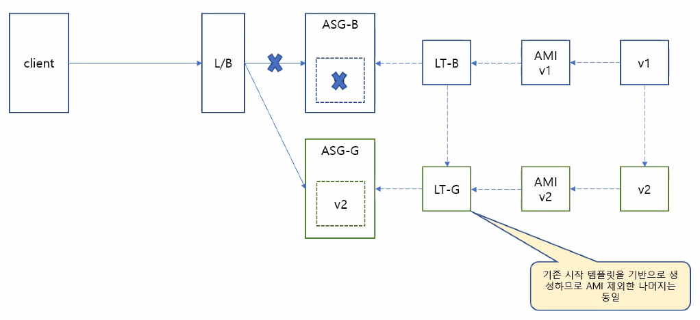

```
Amazon Linux 2 또는 Amazon Linux AMI의 경우 사용자 이름은 ec2-user입니다.
CentOS AMI의 경우 사용자 이름은 centos입니다.
Debian AMI의 경우 사용자 이름은 admin입니다.
Fedora AMI의 경우 사용자 이름은 ec2-user 또는 fedora입니다.
RHEL AMI의 경우 사용자 이름은 ec2-user 또는 root입니다.
SUSE AMI의 경우 사용자 이름은 ec2-user 또는 root입니다.
Ubuntu AMI의 경우 사용자 이름은 ubuntu입니다.
ec2-user 및 root를 사용할 수 없는 경우 AMI 공급자에게 문의하십시오.
```

- blue-green 배포 도식도



