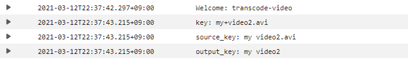
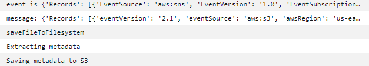

- 파이썬으로 transcode관련 lambda함수 배포하기


## javascript Ver.

1. Create transcode job

```javascript
'use strict';
var AWS = require('aws-sdk');

var elasticTranscoder = new AWS.ElasticTranscoder({
    region: 'us-east-1'
});

exports.handler = function(event, context, callback) {
    console.log('Welcome');
 
    // https://docs.aws.amazon.com/ko_kr/lambda/latest/dg/with-s3.html
    // S3 버킷에 저장된 파일명(=객체명)을 가져옴
    var key = event.Records[0].s3.object.key;   
    // 파일 이름에서 "+" 기호를 " " 문자로 대체하고 URL 디코딩
    // ==> URL 인코딩되었던 파일명을 원본 형태로 변경
    var sourceKey = decodeURIComponent(key.replace(/\+/g, ' '));
    // 확장자를 제거 ==> 파일의 이름 부분만 추출 
    var outputKey = sourceKey.split('.')[0];
    // Elastic Transcoder의 파이프라인에 전달하는 값(인자)
    var params = {
        PipelineId: '본인 id',     // 본인의 것으로 변경
        Input: {
            Key: sourceKey                      // S3 버킷의 객체명(파일명)
        },
        Outputs: [
            {
                // 트랜스코딩된 결과 파일명 ==> 원본파일이름/원본파일이름-프리셋.mp4
                Key: outputKey + '/' + outputKey + '-1080p' + '.mp4', 
                // 미리 정의되어 있는 동영상 포맷
                // https://docs.aws.amazon.com/ko_kr/elastictranscoder/latest/developerguide/system-presets.html
                // 일반 1080p
                PresetId: '1351620000001-000001' 
            },
            {
                Key: outputKey + '/' + outputKey + '-720p' + '.mp4',
                // 일반 720p
                PresetId: '1351620000001-000010' 
            },
            {
                Key: outputKey + '/' + outputKey + '-web-720p' + '.mp4',
                // 웹: Facebook, SmugMug, Vimeo, YouTube
                PresetId: '1351620000001-100070' 
            }
        ]};
 
    //                          인자  , 트랜스코딩이 끝났을 때 호출할 콜백 함수
    elasticTranscoder.createJob(params, function(error, data) {
        if (error) {
            // 트랜스코딩 과정에서 오류가 발생하면 핸들러 함수를 호출한 곳으로 오류를 반환
            callback(error);
        }
    });
};


```

2. Change object permisson

```javascript
'use stric';

var AWS = require('aws-sdk');
var s3 = new AWS.S3();

exports.handler = function(event, context, callback) {
    // SNS 서비스가 전달한 이벤트 객체에서 동영상이 저장된 버킷과 이름(키)을 추출
    var message = JSON.parse(event.Records[0].Sns.Message); // 참조1의 붉은색 부분을 가져와서 JSON 형식으로 변환
    var sourceBucket = message.Records[0].s3.bucket.name;
    var sourceKey = message.Records[0].s3.object.key;
    sourceKey = decodeURIComponent(sourceKey.replace(/\+/g, ' '));

    // 동영상의 접근제어목록(ACL) 속성을 public-read로 설정 -> 외부에서 접근 가능
    var params = {
        Bucket: sourceBucket,
        Key: sourceKey,
        ACL: 'public-read'
    };
    s3.putObjectAcl(params, function(err, data) {
        if (err) {
            callback(err);
        }
    });    
};

```

3. metadata expression

```javascript
'use strict';
var AWS = require('aws-sdk');
// 어플리케이션이 실행되는 호스트의 쉘에서 명령어를 실행
var exec = require('child_process').exec;    
var fs = require('fs');

// PATH 환경 변수에 LAMBDA_TASK_ROOT 환경 변수를 추가
process.env['PATH'] = process.env['PATH'] + ':' + process.env['LAMBDA_TASK_ROOT'];


var s3 = new AWS.S3();

// 메타데이터를 S3 버킷에 파일(객체)로 저장
// body: 메타데이터 내용
function saveMetadataToS3(body, bucket, key, callback) {
    console.log('Saving metadata to S3');
    s3.putObject({
        Bucket: bucket, 
        Key: key, 
        Body: body     // key(파일)의 내용
    }, function(error, data) {
        if (error) {
            callback(error);
        }
    });
}

// 동영상의 메타데이터를 추출 (ffprobe 프로그램을 이용해서)
function extractMetadata(sourceBucket, sourceKey, localFilename, callback) {
    console.log('Extracting metadata');

    var cmd = 'bin/ffprobe -v quiet -print_format json -show_format "/tmp/' + localFilename + '"';
    //                     ~~~~~~~~ ~~~~~~~~~~~~~~~~~~ ~~~~~~~~~~~~ ~~~~~~~~~~~~~~~~~~~~~~~~~~~~
    //                     로그생략 출력형식           메타데이터   동영상경로
    // 명령어 실행에 성공하면 JSON 형식의 메타데이터가 stdout으로 전달
    // 프로젝트 디렉터리(extract-metatdata) 아래에 bin/ffprobe가 존재해야 함
    exec(cmd, function(error, stdout, stderr) {
        if (error === null) {
            // 원본 파일명의 확장자를 json으로 변경
            var metadataKey = sourceKey.split('.')[0] + '.json';
            saveMetadataToS3(stdout, sourceBucket, metadataKey, callback);
        } else {
            console.log(stderr);
            callback(error);
        }
    });
}

// S3 버킷에 있는 동영상을 작업 디렉터리(tmp)로 가져오는 함수
function saveFileToFilesystem(sourceBucket, sourceKey, callback) {
    console.log('Saving to filesystem');

    // 파일명(확장자 포함)만 추출해서 tmp 아래에 파일을 생성
    var localFilename = sourceKey.split('/').pop();
    var file = fs.createWriteStream('/tmp/' + localFilename);

    // S3 버킷의 파일을 읽어와서 tmp 아래에 있는 파일에 저장
    var stream = s3.getObject({
        Bucket: sourceBucket, 
        Key: sourceKey
    }).createReadStream().pipe(file);

    stream.on('error', function(error) {
        callback(error);
    });

    // 파일을 다 가져오면 메타 데이터 추출 함수를 호출
    stream.on('close', function() {
        extractMetadata(sourceBucket, sourceKey, localFilename, callback);
    });
}

exports.handler = function (event, context, callback) {
    // 버킷 이름과 경로 및 확장자를 포함한 파일명을 이벤트에서 추출
    var message = JSON.parse(event.Records[0].Sns.Message);
    var sourceBucket = message.Records[0].s3.bucket.name;
    var sourceKey = decodeURIComponent(message.Records[0].s3.object.key.replace(/\+/g, ' '));

    saveFileToFilesystem(sourceBucket, sourceKey, callback);
};

```

- deploy 과정 in js

```bash
[ec2-user@ip-172-31-62-117 extract-metadata]$ npm install aws-sdk -----------1
[ec2-user@ip-172-31-62-117 extract-metadata]$ vi package.json----------------2
{
  "name": "extract-metadata",
  "version": "1.0.0",
  "description": "",
  "main": "index.js",
  "scripts": {
    "predeploy": "zip -r Lambda-Deployment.zip * -x *.zip *.log node_modules/aws-sdk/*",
    "deploy": "aws lambda update-function-code --function-name Lambda함수의ARN --zip-file fileb://Lambda-Deployment.zip"
  },
  "keywords": [],
  "author": "",
  "license": "ISC",
  "dependencies": {
    "aws-sdk": "^2.862.0"
  }
}
[ec2-user@ip-172-31-62-117 extract-metadata]$ npm run deploy----------3
1,2,3 확인
```


## Python Ver.

1. Create transcode job

```python
import json
import boto3
from urllib.parse import unquote


def lambda_handler(event, context):
    print("Welcome: transcode-video")
    elastictranscoder_client = boto3.client('elastictranscoder')
    key = event['Records'][0]['s3']['object']['key']
    print(f"key: {key}")
    source_key = unquote(key.replace('+', ' '))
    print(f"source_key: {source_key}")
    output_key = source_key.split('.')[0]
    print(f"output_key: {output_key}")
    # https://boto3.amazonaws.com/v1/documentation/api/latest/reference/services/elastictranscoder.html#ElasticTranscoder.Client.create_job
    elastictranscoder_client.create_job(
        PipelineId='***********etc코드 넣자**************',
        Input={
            'Key': source_key
        },
        Outputs=[
            {
                'Key': output_key + '/' + output_key + '-1080p' + '.mp4',
                'PresetId': '1351620000001-000001'
            },
            {
                'Key': output_key + '/' + output_key + '-720p' + '.mp4',
                'PresetId': '1351620000001-000010'
            },
            {
                'Key': output_key + '/' + output_key + '-web-720p' + '.mp4',
                'PresetId': '1351620000001-100070'
            }
        ]
    )
```

2. Change object permisson

```python
import json
import boto3


def lambda_handler(event, context):
    
    s3 = boto3.client('s3')
    
    message = event['Records'][0]['Sns']['Message']
    
    message=json.loads(message)
    
    sourceBucket = message['Records'][0]['s3']['bucket']['name']
    sourceKey = message['Records'][0]['s3']['object']['key']
    
    print(sourceBucket, sourceKey)
    

    response = s3.put_object_acl(ACL='public-read', Bucket = sourceBucket, Key = sourceKey)
    return response
    
```

3. metadata expression

```python
# 람다함수 일반 구성 --> 메모리 256, 제한시간 2분 설정
import json
import boto3
from urllib.parse import unquote
import os

print("Welcome: metadata-extract")
s3_client = boto3.client('s3')


def saveMetadataToS3(body, bucket, key):
    print('Saving metadata to S3')
    s3_client.put_object(
        Bucket=bucket,
        Key=key,
        Body=body
    )


def extractMetadata(sourceBucket, sourceKey, localFilename):
    print('Extracting metadata')
    cmd = 'sudo bin/ffprobe -v quiet -print_format json -show_format "/tmp/' + localFilename + '"'

    data = os.popen(cmd).read()

    metadataKey = sourceKey.split('.')[0] + '.json'
    saveMetadataToS3(data, sourceBucket, metadataKey)


def saveFileToFilesystem(sourceBucket, sourceKey):
    print('saveFileToFilesystem')
    localFilename = sourceKey.split('/').pop()

    obj = s3_client.get_object(
        Bucket=sourceBucket,
        Key=sourceKey
    )
    with open('/tmp/' + localFilename, 'wb') as f:
        for chunk in obj['Body'].iter_chunks(chunk_size=4096):
            f.write(chunk)

    extractMetadata(sourceBucket, sourceKey, localFilename)


def lambda_handler(event, context):
    print("event is ", event)
    message = json.loads(event['Records'][0]['Sns']['Message'])
    print("message:", message)
    sourceBucket = message['Records'][0]['s3']['bucket']['name']
    sourceKey = unquote(message['Records'][0]['s3']['object']['key'].replace('+', ' '))

    saveFileToFilesystem(sourceBucket, sourceKey)


```

- deploy 과정 in py

```bash
1. 디렉터리 생성 후 lambda_function.py 작성
2. $ zip -r Lambda-Deployment.zip * -x *.zip *.log
3. $ aws lambda update-function-code --function-name 람다함수ARN --zip-file fileb://Lambda-Deployment.zip
```

- boto3 .client vs .resources??
  - client가 조금 더 low level, aws api와 1대1 맵핑됨, 모르면 client부터 시작하자
  - resources는 말 그대로 자원에 대한 조작 위주...?

- 이벤트 로그 정리

- 

- 

  ```json
  event is
  {
    'Records': [
      {
        'EventSource': 'aws:sns',
        'EventVersion': '1.0',
        'EventSubscriptionArn': 'arn:aws:sns:us-east-1:924304112663:transcoded-video-notification:f8002a03*606206f0f',
        'Sns': {
          'Type': 'Notification',
          'MessageId': '62e8*cc7c3',
          'TopicArn': 'arn:aws:sns:us-east-1:924304112663:transcoded-video-notification',
          'Subject': 'Amazon S3 Notification',
          'Message': '{
    "Records": [
      {
        "eventVersion": "2.1",
        "eventSource": "aws:s3",
        "awsRegion": "us-east-1",
        "eventTime": "2021-03-12*066Z",
        "eventName": "ObjectCreated:Copy",
        "userIdentity": {
          "principalId": "*"
        },
        "requestParameters": {
          "sourceIPAddress": "2*36*20"
        },
        "responseElements": {
          "x-amz-request-id": "*",
          "x-amz-id-2": "*+ThGmLBDtHWg4uU/*/"
        },
        "s3": {
          "s3SchemaVersion": "1.0",
          "configurationId": "Transcoded-Video",
          "bucket": {
            "name": "serverless-video-transcoded-insolk",
            "ownerIdentity": {
              "principalId": "*"
            },
            "arn": "arn:aws:s3:::serverless-video-transcoded-insolk"
          },
          "object": {
            "key": "my+video2/my+video2-1080px.mp4",
            "size": 14044196,
            "eTag": "*",
            "sequencer": "*"
          }
        }
      }
    ]
  }',
          'Timestamp': '2021-03-12T13:59:34.396Z',
          'SignatureVersion': '1',
          'Signature': '******************',
          'SigningCertUrl': '*',
          'UnsubscribeUrl': '*',
          'MessageAttributes': {
            
          }
        }
      }
    ]
  }
  
     
      메타데이터 결과
      
    {
      "format": {
          "filename": "/tmp/my video2-1080px.mp4",
          "nb_streams": 2,
          "nb_programs": 0,
          "format_name": "mov,mp4,m4a,3gp,3g2,mj2",
          "format_long_name": "QuickTime / MOV",
          "start_time": "0.000000",
          "duration": "30.604000",
          "size": "14044196",
          "bit_rate": "3671205",
          "probe_score": 100,
          "tags": {
              "major_brand": "isom",
              "minor_version": "512",
              "compatible_brands": "isomiso2avc1mp41",
              "encoder": "Lavf57.71.100"
          }
      }
  }
  ```

  