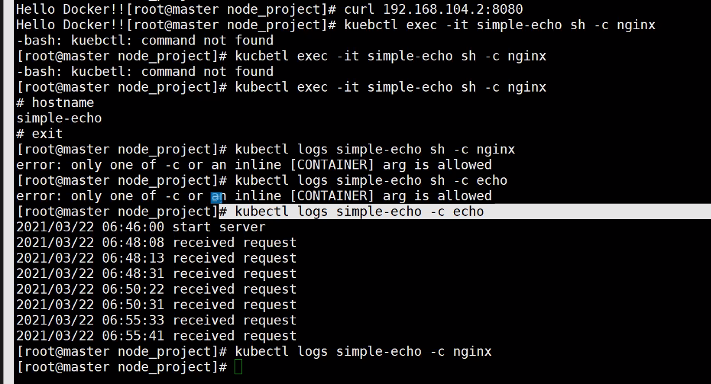
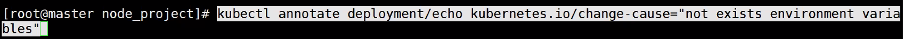

### 쿠버네틱스 포트포워딩 접근법

- ex) node:8000->:8001:->:30000
- curl 127:0.0.1:30000, 마스터 노드에서 접속가능한 포트
- curl 클러스터ip:8001, 클러스터 ip로 서비스파일에서 포트 지정한 곳으로 사용 가능
- curl 컨테이너ip:8000, 컨테이너 생성 후 해당 서비스 제공되는 ip로 접속됨
- vagrant등 외부 포트포워딩을 한번 더하면 윈도우 웹브라우저에서도 사용가능
  - `cfg.vm.network "forwarded_port", guest: 31020, host: 60000일 때, 127.0.0.1:60000`

- single point failure 을 막기위해 마스터 노드를 3개 이상 보유하는 것을 추천

[2021-02-19](2021-02-19.md) 파일 참조 - 도커 이미지 생성

`kubectl annotate deployment/echo kubernetes.io/change-cause="not exists environment variables"`

