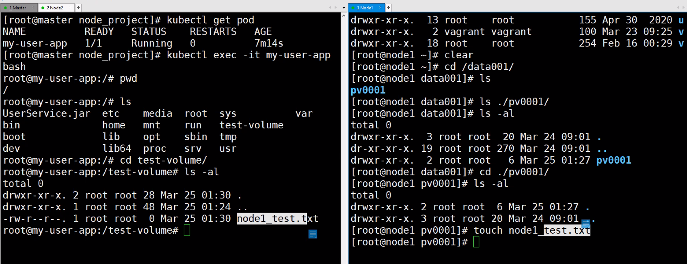
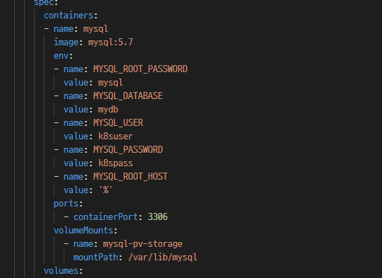
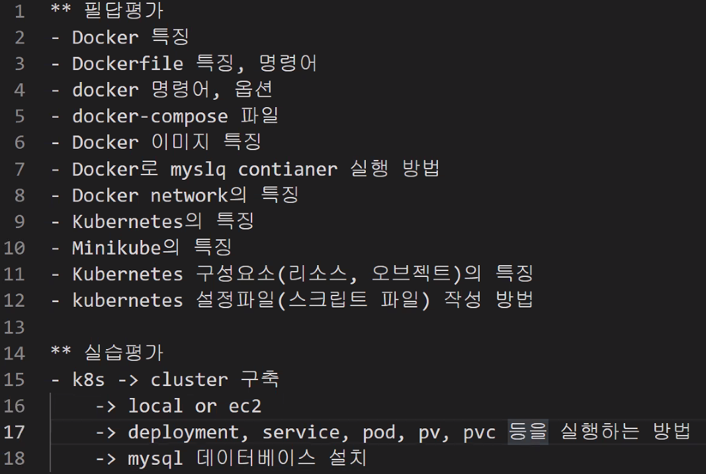

`kubectl delete all --all` - 쿠버네티스 리소스 전부 삭제

`mysql -u root -p --port 3306 -h 10.10.10.20`

### persistence volume



- 해당 노드와 마스터 노드에서 txt파일을 만들고 공유가 되는지 확인




- docker 생성시에 옵션으로 root 패스워드를 지정해 준것 처럼 yaml파일의 env인 환경변수를 통해 아이디, 비밀번호같은 변수 설정이 가능

- `error: error parsing mysql-deployment.yml: error converting YAML to JSON: yaml: line 23: found character that cannot start any token`에러시 탭이 들어있는지 확인!

- secret 변환 확인

  ```bash
  [vagrant@master ~]$ echo MTIzNA== | base64 --decode
  1234
  [vagrant@master ~]$ echo -n "hello" | base64
  aGVsbG8=
  
  [vagrant@master ~]$ kubectl get secret mysql-password -o yaml > secret.yml
  [vagrant@master ~]$ cat secret.yml 
  apiVersion: v1
  data:
    password: aGVsbG8=
  kind: Secret
  ......;
  ```

  