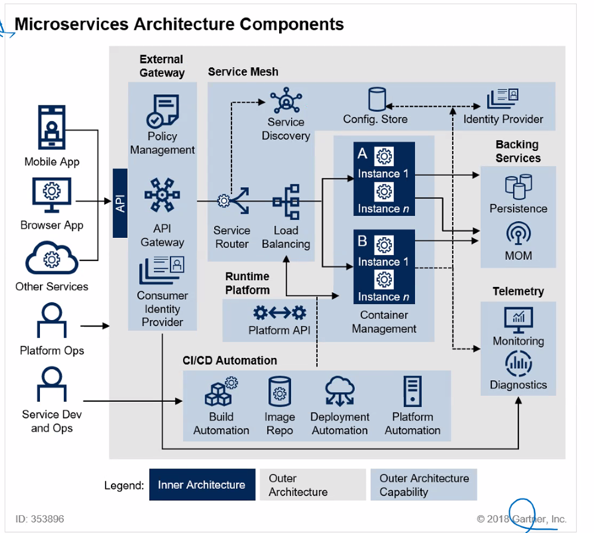

ㅜㅜㅜ 저장을 안했어요....

- ec2로 ansible실습
- kafka사용
- 

- `bin\windows\zookeeper-server-start.bat config/zookeeper.properties`
- `bin\windows\kafka-server-start.bat config/server.properties`
- `bin\windows\kafka-topics.bat --create --topic my_topic_users --bootstrap-server localhost:9092`
- `bin\windows\kafka-topics.bat --describe --topic quickstart-events --bootstrap-server localhost:9092`
- `bin\windows\kafka-topics.bat --list --bootstrap-server localhost:9092`
- `bin\windows\kafka-console-producer.bat --topic quickstart-events --bootstrap-server localhost:9092`
- `bin\windows\kafka-console-consumer.bat --topic quickstart-events --from-beginning --bootstrap-server localhost:9092`