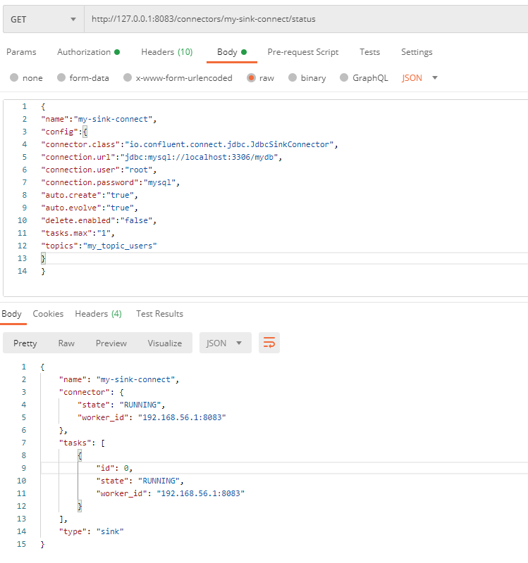

- rabbitMQ 찾아보기, kafka와 비슷한 솔루션
- `CQRS` - commend와 Query, 명령과 조회의 책임을 분리 하겠다는 의미

1. source connect 생성(POST)
2. source connect 확인(GET)
3. Topic List 확인
4. DB(Heidi) -> 데이터 추가
5. Topic List 다시 확인
6. 삭제 하려면 HTTP DELETE method로 http://localhost:8083/connectors/[생성한 source connect의 이름]

