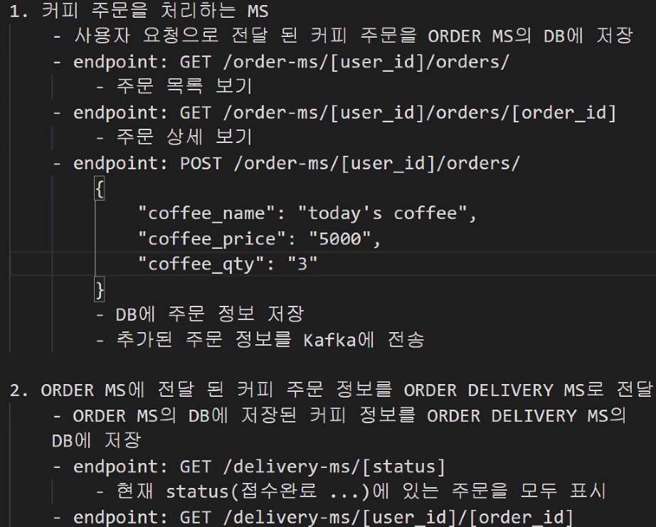

### flask

- `conda create -n msa python=3.8 flask`

- `conda activate msa`

- `pip list`

- ```python
  from flask import Flask, jsonify
  
  app = Flask(__name__)
  
  # http://127.0.0.1:5000/
  @app.route('/')
  def index():
      return "Hello, world!"
  
  # http://127.0.0.1:5000/health-check
  @app.route('/health-check')
  def health_check():
      return "Server is running on 5000 port"
  
  # http://127.0.0.1:5000/users
  @app.route('/users')
  def users():
      return "** Users List"
  
  # http://127.0.0.1:5000/users/<usersId>
  @app.route('/users/<userId>')
  def users_detail(userId):
      # return "{\"name\": %s}" % (userId)
      return jsonify({"user_id": userId})
  
  if __name__ == "__main__":
      app.run()
  ```

- `flask run --port 3000`

- `set FLASK_APP=rest1.py`

- 

`insert into coffee_order(coffee_name, coffee_price, coffee_qty, user_id) values ('today''s coffee', 5000, 3, 1);`

```mysql
create table orders(
    id int auto_increment primary key,
    user_id varchar(100) not null,
    order_id varchar (100) not null,
    coffee_name varchar (100) not null,
    coffee_price int not null,
    coffee_qty int default 1,
    ordered_at varchar(50)
);

DROP TABLE orders;

DELETE FROM orders [WHERE 조건];
```


