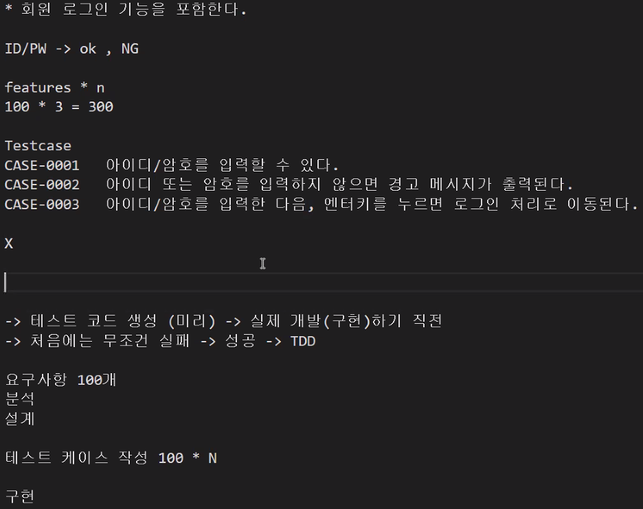

- TDD 설명

- 잘 만들고 404 오류났을 땐, url 주소 `/` 다시 확인!
- post에서 create한 경우 200 보단 201 코드가 더 적절
- `conda activate msa`
- `set FLASK_APP=order_ms.py`
- `set FLASK_DEBUG=1`
- `flask run --port 3000`
- `TypeError: Object of type zip is not JSON serializable`에서 zip을 dict로 묶자!
- `pip install kafka-python` 꼭 kafka 파이썬으로 설치하자
- 데이터 변경이 되지않으면 `commit()` 함수 확인!