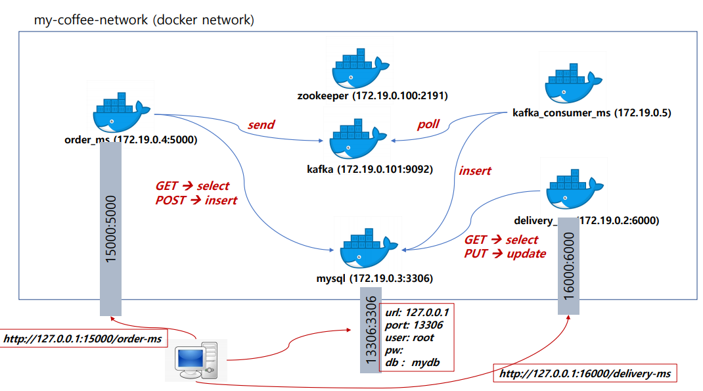

## MS Docker 구성

- `docker run -d -p 13306:3306 -e MYSQL_ALLOW_EMPTY_PASSWORD=true --network my-coffee-network --name mydb mysql:5.7`

- `docker network ls`

- `docker network inspect <id>`

- `docker inspect <container name>`으로 ip description 확인

  ```mysql
  create database mydb;
  use mydb;
  
  CREATE TABLE IF NOT EXISTS `delivery_status` (
    `id` int(11) NOT NULL AUTO_INCREMENT,
    `delivery_id` varchar(50) DEFAULT NULL,
    `order_json` text DEFAULT NULL,
    `status` varchar(50) DEFAULT NULL,
    `created_at` datetime DEFAULT current_timestamp(),
    PRIMARY KEY (`id`)
  ) ENGINE=InnoDB AUTO_INCREMENT=18 DEFAULT CHARSET=utf8;
  
  CREATE TABLE IF NOT EXISTS `orders` (
    `id` int(11) NOT NULL AUTO_INCREMENT,
    `user_id` varchar(100) NOT NULL,
    `order_id` varchar(100) NOT NULL,
    `coffee_name` varchar(100) NOT NULL,
    `coffee_price` int(11) NOT NULL,
    `coffee_qty` int(11) DEFAULT 1,
    `ordered_at` varchar(50) DEFAULT NULL,
    PRIMARY KEY (`id`)
  ) ENGINE=InnoDB AUTO_INCREMENT=21 DEFAULT CHARSET=utf8;
  
  ```

- mariadb 말고 pymysql로 변경

- 가변 데이터 처리시 `?` -> `%s`로 변경

- `docker build -t insolk/flask_delivery_ms -f .\Dockerfile_delivery .`

- `docker run -d -p 16000:6000 --network my-coffee-network --name delivery_ms insolk/flask_delivery_ms`

- `docker run -d -p 15000:5000 --network my-coffee-network --name order_ms insolk/flask_order_ms`

- `docker-compose -f .\docker-compose-single-broker.yml up -d `

```dockerfile
dockerfile_delivery


FROM python:3.7.9-stretch

RUN pip install pymysql
RUN pip install flask
RUN pip install flask_restful


WORKDIR /mydata

COPY ./delivery_ms.py ./app.py

CMD ["flask","run","--host","0.0.0.0","--port", "6000"]

dockerfile_order

FROM python:3.7.9-stretch

RUN pip install pymysql
RUN pip install flask
RUN pip install flask_restful
RUN pip install kafka_python


WORKDIR /mydata

COPY ./order_ms.py ./app.py

CMD ["flask","run","--host","0.0.0.0","--port", "5000"]


```

`docker network create --gateway 172.19.0.1 --subnet 172.19.0.0/24 my-coffee-network`

```yaml
singlebroker
version: '2'
services:
  zookeeper:
    image: wurstmeister/zookeeper
    ports:
      - "2181:2181"
    networks:
      my-network:
        ipv4_address: 172.19.0.100
  kafka:
    image: wurstmeister/kafka
    ports:
      - "9092:9092"
    environment:
      KAFKA_ADVERTISED_HOST_NAME: 172.19.0.101
      KAFKA_CREATE_TOPICS: "test:1:1"
      KAFKA_ZOOKEEPER_CONNECT: zookeeper:2181
    volumes:
      - /var/run/docker.sock:/var/run/docker.sock
    depends_on:
      - zookeeper
    networks:
      my-network:
        ipv4_address: 172.19.0.101

networks:
  my-network:
    name: my-coffee-network
```


