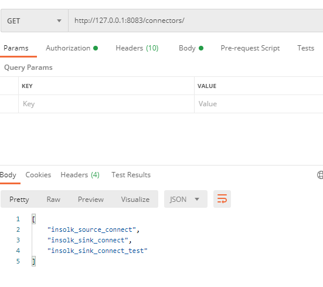
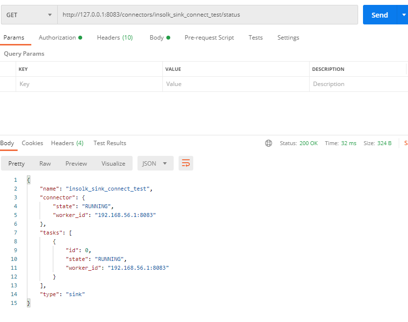
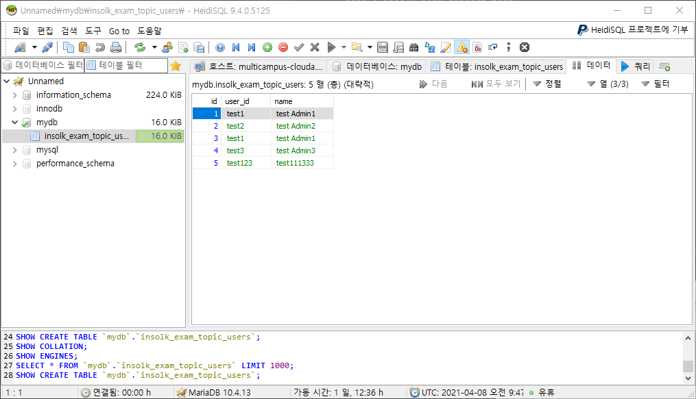

  # cloud_module_project

  ### 기간: 4/8 ~ 4/27 (13일)
  ### 주제, 범위
      - 주제 (2)
      - 분석 (벤치마킹) (2), 일정 조정
      - 설계(업무분담) (2), 인프라구축
      - 구현 (5)
      - 테스트(1) 
      - 배포(1)
  ### 기술
      - Cloud Native Application -> 예약시스템, 학사관리, 쇼핑몰, 중고상품매매... 
          - MSA + Infra -> AWS 
      - Language: Python + NodeJs + Java ... 
      - Front-end: (Option) HTML + JavaScript + jQuery + React + CSS ...
          - Template  사용가능 
      - Back-end: Python + NodeJs + Java
      - DB: Mysql + Mariadb + Oracle ... 
      - Public Cloud: AWS + Services (EC2, RDS, Route53, Lambda, EKS(K8s))
      - Container Virtualization: Docker container 
      - Orchestration tool: K8s
      - Backing Service: Kafka 
      - Infrastructure of Code: Ansible 
  ### 코드 관리 (버전 관리)    
      - Git: github(O), bitbucket(O), gitlab
  ### 프로젝트 관리 및 스케줄 관리 (Project Management)
      - ex) Freedcamp, freedcamp.com 
      - ex) Redmine, https://www.easyredmine.com


### 수행 과제 정리

- 쉘 스크립트 실행 정리

```bash
-------------shell 1-------------
[C:\work\kafka_2.13-2.7.0]$ bin\windows\zookeeper-server-start.bat config/zookeeper.properties

-------------shell 2-------------
[C:\work\kafka_2.13-2.7.0]$ bin\windows\kafka-server-start.bat config/server.properties

-------------shell 3-------------
[C:\work\kafka_2.13-2.7.0]$ bin\windows\kafka-topics.bat --create --topic insolk_exam_topic_users --bootstrap-server localhost:9092
WARNING: Due to limitations in metric names, topics with a period ('.') or underscore ('_') could collide. To avoid issues it is best to use either, but not both.Created topic insolk_exam_topic_users.

[C:\work\kafka_2.13-2.7.0]$ bin\windows\kafka-topics.bat --list --bootstrap-server localhost:9092
__consumer_offsets
connect-configs
connect-offsets
connect-status
insolk_exam_topic_users

[C:\work\kafka_2.13-2.7.0]$ bin\windows\kafka-console-consumer.bat --topic insolk_exam_topic_users --from-beginning --bootstrap-server localhost:9092
{"schema":{"type":"struct","fields":[{"type":"int32","optional":false,"field":"id"},{"type":"string","optional":false,"field":"user_id"},{"type":"string","optional":false,"field":"name"}],"optional":false,"name":"users"},"payload":{"id":1,"user_id":"test1","name":"test Admin1"}}
{"schema":{"type":"struct","fields":[{"type":"int32","optional":false,"field":"id"},{"type":"string","optional":false,"field":"user_id"},{"type":"string","optional":false,"field":"name"}],"optional":false,"name":"users"},"payload":{"id":2,"user_id":"test2","name":"test Admin2"}}
{"schema":{"type":"struct","fields":[{"type":"int32","optional":false,"field":"id"},{"type":"string","optional":false,"field":"user_id"},{"type":"string","optional":false,"field":"name"}],"optional":false,"name":"users"},"payload":{"id":3,"user_id":"test1","name":"test Admin1"}}
{"schema":{"type":"struct","fields":[{"type":"int32","optional":false,"field":"id"},{"type":"string","optional":false,"field":"user_id"},{"type":"string","optional":false,"field":"name"}],"optional":false,"name":"users"},"payload":{"id":4,"user_id":"test3","name":"test Admin3"}}
{"schema":{"type":"struct","fields":[{"type":"int32","optional":false,"field":"id"},{"type":"string","optional":false,"field":"user_id"},{"type":"string","optional":false,"field":"name"}],"optional":false,"name":"users"},"payload":{"id":5,"user_id":"test123","name":"test111333"}}

-------------shell 4-------------
[C:\work\kafka_connect\confluent-6.1.0]$ .\bin\windows\connect-distributed.bat .\etc\kafka\connect-distributed.properties
```

- 제출 kafka_connect 스크립트 정리

```json
-------------source_connect 스크립트-------------
{
    "name" : "insolk_source_connect",
    "config" : {
    "connector.class" : "io.confluent.connect.jdbc.JdbcSourceConnector",
    "connection.url":"jdbc:mysql://localhost:3306/mydb",
    "connection.user":"root",
    "connection.password":"***",
    "mode": "incrementing",
    "incrementing.column.name" : "id",
    "table.whitelist":"users",
    "topic.prefix" : "insolk_exam_topic_",
    "tasks.max" : "1"
    }
}

curl -X POST -d @- http://localhost:8083/connectors --header "content-Type:application/json"

-------------sink_connect aws용 스크립트-------------
{
    "name":"insolk_sink_connect",
    "config":{
    "connector.class":"io.confluent.connect.jdbc.JdbcSinkConnector",
    "connection.url":"jdbc:mysql://multicampus-clouda.***.us-east-1.rds.amazonaws.com:3306/mydb",
    "connection.user":"***",
    "connection.password":"****",
    "auto.create":"true",
    "auto.evolve":"true",
    "delete.enabled":"false",
    "tasks.max":"1",
    "topics":"insolk_exam_topic_users"
    }
}

 curl -X POST -d @- http://localhost:8083/connectors --header "content-Type:application/json"


-------------sink_connect 로컬 테스트용 스크립트-------------
{
    "name":"insolk_sink_connect_test",
    "config":{
    "connector.class":"io.confluent.connect.jdbc.JdbcSinkConnector",
    "connection.url":"jdbc:mysql://localhost:3306/mydb",
    "connection.user":"root",
    "connection.password":"***",
    "auto.create":"true",
    "auto.evolve":"true",
    "delete.enabled":"false",
    "tasks.max":"1",
    "topics":"insolk_exam_topic_users"
    }
}

 curl -X POST -d @- http://localhost:8083/connectors --header "content-Type:application/json"
```





