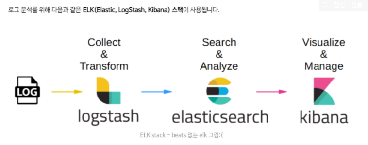

- Elastic Search / kibana / logstash ELK

  - https://www.elastic.co/kr/what-is/elk-stack
  - https://captcha.tistory.com/44
  - https://heowc.tistory.com/49
  - 엘라스틱서치 자체를 검색엔진으로 사용해도 될듯?

  

- Fluentd

  - https://www.fluentd.org/
  - https://jonnung.dev/system/2018/04/06/fluentd-log-collector-part1/
  - 로그 수집기, tag, time, record로 이루어짐ㄴ

- auth0 vs AWS Cognito
  - https://aws.amazon.com/ko/blogs/korea/how-to-own-user-auth-service-using-amazon-cognito/
- Django vs Flask
  - flask쓰자
- FE: react, vue, angular
  - 템플릿으로 바닐라 html, js로 프론트 만들자