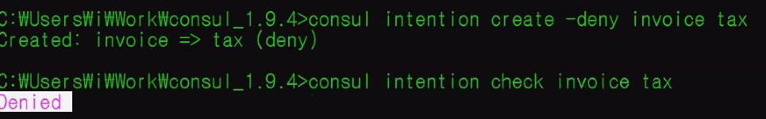

`consul agent -dev -ui -datacenter zone1 -node host1 -config-dir ./consul.d`

`http://localhost:8500/ui/zone1/services` 접속

각각 서비스별로 json파일을 /consul.d 폴더에 저장

```json
{
    "service": {

        "name": "tax",
        "tags": ["taxs"],
        "port": 15002,
        "address": "127.0.0.1"
    }
}
```

- dig 사용
- 

- `set INV_SVC_URL=http://127.0.0.1:15001`
- `set TAX_SVC_URL=http://127.0.0.1:15002`
- `python order.py ....`
- 실행시 안되면 powershell 말고 cmd로 할 것
- `consul connect proxy -sidecar-for order &`



### 개발!

- `python manage.py inspectdb > potatomarket/models.py`
- `python manage.py makemigrations app_name `
- `python manage.py migrate app_name`
- `python manage.py createsuperuser`
- `python manage.py runserver`