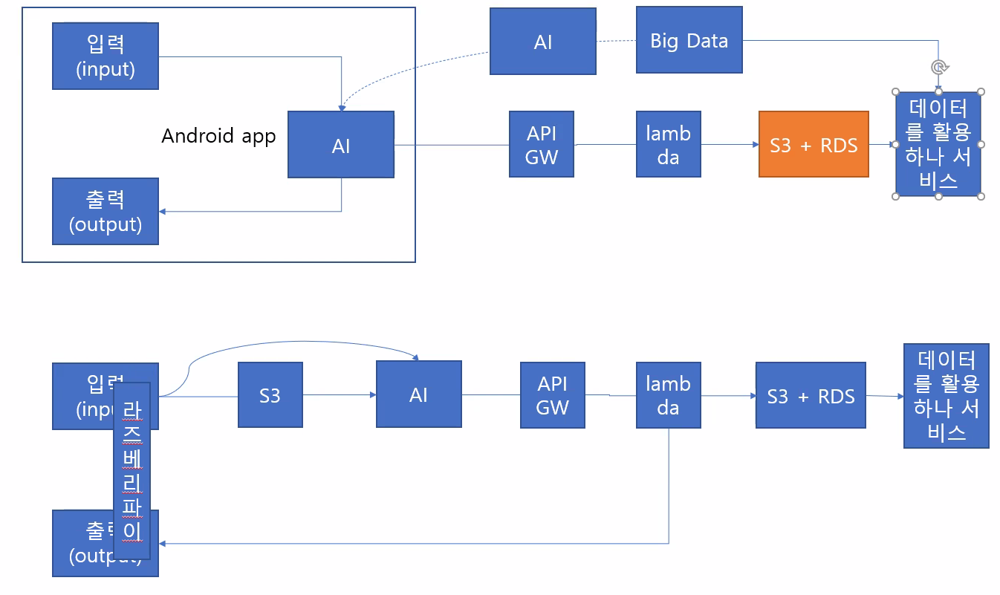

-  https://myanjini.tistory.com/entry/POST-%EB%B0%A9%EC%8B%9D%EC%9C%BC%EB%A1%9C-S3-%EB%B2%84%ED%82%B7%EC%97%90-%ED%8C%8C%EC%9D%BC-%EC%97%85%EB%A1%9C%EB%93%9C-1
- https://myanjini.tistory.com/entry/POST-%EB%B0%A9%EC%8B%9D%EC%9C%BC%EB%A1%9C-S3-%EB%B2%84%ED%82%B7%EC%97%90-%ED%8C%8C%EC%9D%BC-%EC%97%85%EB%A1%9C%EB%93%9C-2
- https://076923.github.io/posts/#Python-OpenCV

데이터를 어떻게, 어떤 형식으로 주고 받을지 연결하고 테스트하자

그이후에 효율 및 성능을 높이는 방식으로 실행